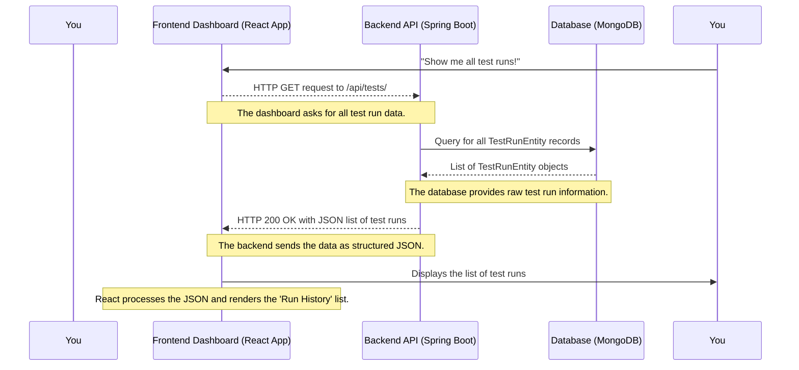

# Chapter 1: Frontend Test Dashboard

Imagine you have many automated tests for your software. How do you keep track of them all? How do you know if they passed or failed yesterday? What if you want to run a specific set of tests right now, or schedule them for every night? Doing all this manually can be a huge headache!

This is where the **Frontend Test Dashboard** for `lenstest` comes to the rescue! Think of it as your personal control panel, a friendly website in your browser where you can see *everything* about your test automation. It's built with a popular web technology called React, making it interactive and easy to use.

## What Problem Does it Solve?

The main problem the Frontend Test Dashboard solves is bringing clarity and control to your test automation. Instead of digging through logs or command-line outputs, you get a beautiful, interactive overview. It helps you answer questions like:

*   "Did our nightly tests pass?"
*   "What happened in that specific test run last week?"
*   "Can I easily start a new test run for just the new features?"
*   "When is that important test suite scheduled to run next?"

It’s like having a mission control center for all your software tests!

## A Simple Use Case: Viewing Your Test History

Let's walk through a common scenario to understand the dashboard better: **viewing the results of a past test run**. This is one of the most fundamental tasks the dashboard helps you with.

When you open the `lenstest` dashboard in your web browser, you'll immediately see a list of all your test runs, from the most recent to older ones. Each entry tells you if the run finished successfully, failed, or is still in progress.

### Key Concepts of the Dashboard

Before we dive into how to view a past run, let's quickly understand the main parts of this dashboard:

1.  **Historical Test Runs**: This is a list of all tests that have ever been executed. You can see their overall status (passed, failed, in progress), when they started, and how long they took.
2.  **Real-time Execution Progress**: If tests are running right now, you can see their live status updates directly on the dashboard.
3.  **Detailed Reports**: For each test run, you can drill down to see reports for individual "features," "scenarios," and even each "step" within a scenario, including any logs or error messages.
4.  **Scheduling New Test Runs**: You can set up tests to run automatically at specific times (e.g., every day at midnight).
5.  **Manually Triggering Tests**: Need to run a test right now? You can do that directly from the dashboard.
6.  **Intuitive Visualization**: Graphs and clear status indicators help you quickly understand the health of your test suite.

### How to Use the Dashboard for Our Use Case

To view the results of a past test run, you would typically:

1.  **Open the Dashboard**: Navigate to the `lenstest` application in your web browser.
2.  **See the "Run History"**: The main page (handled by `RunHistory.js`) shows a list of recent test runs.

    ```javascript
    // frontend/src/components/RunHistory/RunHistory.js
    const RunHistory = ({ props, tagOptions }) => {
        // ... other state and functions ...

        return (
            // ... lots of HTML for displaying filter options, donut charts ...
            <div className="col-l d-flex flex-column gap-4">
                {filteredData.length > 0 ? (
                    filteredData.map((item, index) => (
                        <Link to={`/${item.id}`} key={index}> {/* <-- Link to individual run details */}
                            <div className="row card">
                                <div className="card-body ms-1 d-flex flex-column gap-2 pb-0">
                                    <div className="run-title">
                                        {/* Display status icon (passed/failed/in progress) */}
                                        {item.executionStage === "FINISHED" && (
                                          <i className="bi bi-check-circle-fill success-color"></i>
                                        )}
                                        {/* ... other status checks ... */}
                                        <span className="ms-2 fw-semibold">Run #{item.id}</span>
                                    </div>
                                    {/* ... display run details like type, duration, dates ... */}
                                </div>
                                {/* ... footer with filter tags ... */}
                            </div>
                        </Link>
                    ))
                ) : (
                    // ... message for no runs found ...
                )}
            </div>
            // ... rest of the component ...
        );
    };
    ```
    This React code snippet shows how `RunHistory.js` lists each test run. Each run is a clickable link (`<Link>`) that takes you to its detailed report. You'll see an icon indicating the run's overall status (e.g., a green check for "FINISHED" or a red 'X' for "FAILED").

3.  **Click on a Test Run**: Clicking any run in the list takes you to its specific "Run Detail" page (handled by `RunDetail.js`).

    ```javascript
    // frontend/src/components/RunDetail/RunDetail.js
    const RunDetail = (data) => {
        // ... state and chart data setup ...

        return (
            <div className="container d-flex flex-column gap-4 pb-5">
                <div className="row mt-4">
                    <div className="col page-header ps-0">
                        <h5>
                            {/* Display overall run status */}
                            {data.executionStage === "FINISHED" && (
                              <i className="bi bi-check-circle-fill success-color"></i>
                            )}
                            {/* ... other status checks ... */}
                            Run #{data.id}
                        </h5>
                    </div>
                    {/* ... buttons for show/hide summary ... */}
                </div>
                {showSummary && ( // Display summary charts if 'showSummary' is true
                    <div className="test-summary">
                        {/* ... Doughnut charts for Features, Scenarios, Steps ... */}
                        {/* ... Table for Tag statistics ... */}
                    </div>
                )}
                <div className="test-details">
                    {/* ... filter options for features, scenarios, tags ... */}
                    <div className="row pe-4">
                        {/* Features List - Left Side */}
                        <div className="col-4 scroll-visible d-flex flex-column gap-2 mt-3 ps-4 mb-4">
                            {/* ... Map through features to display them ... */}
                        </div>
                        {/* Scenarios List - Right Side */}
                        <div className="col-8 mt-3 scroll-visible">
                            {/* ... Map through scenarios of the selected feature ... */}
                            <Link // Each scenario is also a clickable link
                                key={scenarioKey}
                                type="button"
                                to={`/${data.id}/scenario/${scenario.id}`}
                                onClick={() => setSelectedScenario(scenarioKey)}
                                // ... styling ...
                            >
                                {/* ... scenario name, tags, duration, dates ... */}
                            </Link>
                        </div>
                    </div>
                </div>
            </div>
        );
    };
    ```
    On this page, you'll see a summary with charts showing the percentage of passed/failed/skipped "features," "scenarios," and "steps." Below that, there are detailed lists of each feature and its associated scenarios.

4.  **Click on a Scenario**: If you want to dive even deeper, clicking on a specific scenario brings up its "Scenario Detail" page (handled by `ScenarioDetail.js`).

    ```javascript
    // frontend/src/components/ScenarioDetail/ScenarioDetail.js
    const ScenarioDetail = (scenario) => {
        // ... state for managing height ...

        return (
            <div className="container d-flex flex-column pb-5">
                <div className="row mt-4">
                    <div className="card px-0">
                        <div className="card-body">
                            <div className="row mx-1">
                                <div className="col">
                                    <h4 // Display scenario name and status color
                                        className={`fw-bold ${
                                            scenario.status === "PASSED"
                                                ? "success-color"
                                                : "failed-color"
                                        }`}
                                    >
                                        {scenario.name}
                                    </h4>
                                </div>
                                {/* ... duration and date info ... */}
                            </div>
                            <div className="mx-3">
                                {/* ... display tags ... */}
                            </div>
                            <div className="d-flex flex-column gap-4 mt-4">
                                {scenario?.steps && // Loop through steps in the scenario
                                    scenario.steps.length > 0 &&
                                    Object.entries(scenario.steps).map(([stepKey, step], index) => (
                                        <div className="row box px-2 py-2 mx-2" key={stepKey}>
                                            <div
                                                className="row pt-2"
                                                data-bs-target={`#step-detail-${index}`}
                                                data-bs-toggle="collapse" // Clickable to expand/collapse details
                                                // ... styling for clickable rows ...
                                            >
                                                <div className="col">
                                                    <h5 // Display step name and status color
                                                        className={`step-header ${
                                                            step.status === "PASSED"
                                                                ? "success-color"
                                                                : step.status === "FAILED"
                                                                ? "failed-color"
                                                                : "skipped-color"
                                                        }`}
                                                    >
                                                        {step.name}
                                                    </h5>
                                                </div>
                                                {/* ... step duration ... */}
                                            </div>
                                            {step.dataTable && ( /* Display data table if present */
                                                // ... table rendering ...
                                            )}
                                            <div id={`step-detail-${index}`} className="collapse show">
                                                {step.logs && ( /* Display step logs if present */
                                                    // ... log rendering ...
                                                )}
                                                {step.error && ( /* Display error message if present */
                                                    <div className="row step-error ms-0 p-3 mb-3">
                                                        {step.error}
                                                    </div>
                                                )}
                                            </div>
                                        </div>
                                    ))}
                            </div>
                        </div>
                    </div>
                </div>
            </div>
        );
    };
    ```
    Here, you'll see a detailed breakdown of each individual step within that scenario. If a step failed, you'll see the exact error message and any relevant logs, helping you quickly figure out what went wrong.

This step-by-step navigation makes it incredibly easy to go from a high-level overview of all runs to the precise details of a single failing step.

## Under the Hood: How the Dashboard Works

So, how does this magic happen? Let's take a peek behind the curtain to understand what's going on when you interact with the dashboard.

### The Request Flow

When you open the `lenstest` dashboard in your browser and want to see the list of past test runs, here's a simplified sequence of events:



1.  **You** (the User) open the browser to the `lenstest` application.
2.  The **Frontend Dashboard** (your React application) needs to display the list of test runs.
3.  The Frontend sends a request to the **Backend API** (our Spring Boot application) asking for all test run data. This is like asking a librarian for all the books in the library.
4.  The Backend receives this request and asks the **Database** (MongoDB) to retrieve all `TestRunEntity` records. These records contain all the information about each test run.
5.  The Database sends back the list of `TestRunEntity` objects to the Backend.
6.  The Backend then converts this data into a format the Frontend understands (JSON) and sends it back to the Frontend.
7.  Finally, the Frontend takes this JSON data and draws the "Run History" list on your screen, complete with statuses, dates, and links.

### The Code Behind the Scenes

Let's look at some simplified code snippets that make this happen.

First, the `App.js` file, which is the main part of our frontend application, is responsible for fetching the initial list of test runs when the page loads:

```javascript
// frontend/src/App.js
import React, { useEffect, useState, useMemo } from "react";
// ... other imports ...

const App = () => {
  const [results, setResults] = useState([]); // State to hold all test run data

  // Fetch full result history on initial page load
  useEffect(() => {
    fetch("http://localhost:8080/api/tests/") // Make an HTTP request to our backend API
      .then((res) => res.json()) // Once data arrives, parse it as JSON
      .then((json) => {
        setResults(json); // Update our component's state with the fetched data
      });
  }, []); // The empty array means this runs only once when the component first appears

  // ... other code for routing and real-time updates ...

  return (
    <div>
      {/* ... navigation and routes ... */}
      <RunHistory props={buildProps} tagOptions={tagOptions} /> {/* Render the RunHistory component */}
      {/* ... other routes ... */}
    </div>
  );
};

export default App;
```
This `useEffect` hook in `App.js` performs an `HTTP GET` request to `http://localhost:8080/api/tests/`. This is how the frontend asks the backend for the list of all test runs. Once the data comes back, it's stored in the `results` state, which then gets passed to the `RunHistory` component to display.

On the backend side, the `TestExecutionController.java` file handles this request:

```java
// src/main/java/com/db/lenstest/controller/TestExecutionController.java
package com.db.lenstest.controller;

import com.db.lenstest.lensEntity.TestRunEntity;
import com.db.lenstest.lensRepository.TestRunEntityRepository;
import org.springframework.beans.factory.annotation.Autowired;
import org.springframework.web.bind.annotation.*;
import java.util.List;

@RestController // Marks this class as a Spring REST controller
@RequestMapping("/api/tests") // All endpoints in this class start with /api/tests
@CrossOrigin(origins = "*") // Allows web browsers from any origin to access this API
public class TestExecutionController {

    @Autowired
    private TestRunEntityRepository testRunEntityRepository; // Automatically connects to our database helper

    // ... other methods for executing and scheduling tests ...

    @GetMapping("/") // This method handles HTTP GET requests to /api/tests/
    public List<TestRunEntity> getAllTestRuns(){
        // Fetch all test run records from the database
        // .collectList().block() is a way to get all results from a reactive stream
        return testRunEntityRepository.findAll().collectList().block();
    }

    // ... other methods ...
}
```
The `@GetMapping("/")` annotation tells Spring Boot that when an HTTP `GET` request comes to `/api/tests/`, it should run the `getAllTestRuns()` method. This method then uses `testRunEntityRepository` to talk to the database, fetch all `TestRunEntity` objects, and return them. Spring Boot automatically converts this list of objects into JSON format before sending it back to the frontend.

## Conclusion

In this chapter, we've explored the **Frontend Test Dashboard** for `lenstest`. We learned that it's your central, interactive web interface for managing and visualizing your test automation suite. It solves the problem of needing a clear, user-friendly overview of your tests, historical data, and real-time progress. We walked through a core use case: viewing past test runs, and saw how the `RunHistory`, `RunDetail`, and `ScenarioDetail` components in the React frontend work with the `TestExecutionController` in the Spring Boot backend to fetch and display this information from the database.

The dashboard makes it simple to understand the state of your tests at a glance and dive into details when needed. Next, we'll look at another powerful feature of the dashboard: how it helps with [Scheduled Test Management](02_scheduled_test_management_.md), allowing you to automate when your tests run!

---

<sub><sup>Generated by [AI Codebase Knowledge Builder](https://github.com/The-Pocket/Tutorial-Codebase-Knowledge).</sup></sub> <sub><sup>**References**: [[1]](https://github.com/amangupta0709/lenstest/blob/1105aa93ea0a8c60528ac519e6b0525f06c79c72/frontend/src/App.js), [[2]](https://github.com/amangupta0709/lenstest/blob/1105aa93ea0a8c60528ac519e6b0525f06c79c72/frontend/src/components/RunDetail/RunDetail.js), [[3]](https://github.com/amangupta0709/lenstest/blob/1105aa93ea0a8c60528ac519e6b0525f06c79c72/frontend/src/components/RunHistory/RunHistory.js), [[4]](https://github.com/amangupta0709/lenstest/blob/1105aa93ea0a8c60528ac519e6b0525f06c79c72/frontend/src/components/ScenarioDetail/ScenarioDetail.js), [[5]](https://github.com/amangupta0709/lenstest/blob/1105aa93ea0a8c60528ac519e6b0525f06c79c72/frontend/src/components/ScheduledRun/ScheduledRun.js), [[6]](https://github.com/amangupta0709/lenstest/blob/1105aa93ea0a8c60528ac519e6b0525f06c79c72/src/main/java/com/db/lenstest/controller/TestExecutionController.java)</sup></sub>
© 2025 Codebase to Tutorial. All rights reserved.
Terms of Service
