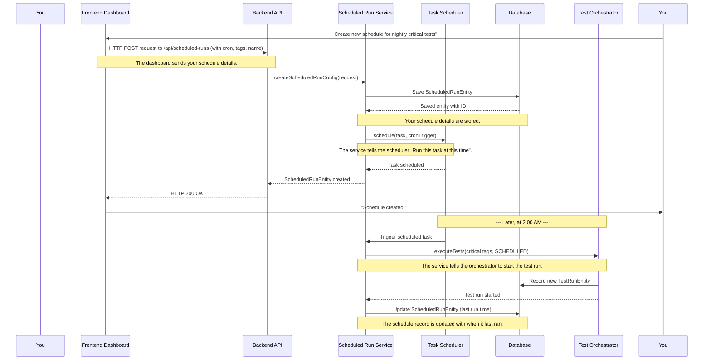

# Chapter 2: Scheduled Test Management

Welcome back! In [Chapter 1: Frontend Test Dashboard](01_frontend_test_dashboard_.md), we learned how `lenstest` provides a friendly control panel to view and understand your test results. You saw how easy it is to look at past runs, see their statuses, and drill down into details.

But what if you don't want to manually click a button to start a test run every time? What if you want your tests to run automatically, like clockwork? This is where **Scheduled Test Management** comes in!

## What Problem Does it Solve?

Imagine you have a set of important "smoke tests" or "regression tests" that you need to run every night at midnight to make sure your software hasn't broken anything fundamental. Doing this manually every single night can be tedious and prone to human error. What if someone forgets?

Scheduled Test Management solves this by letting you set up **automated test execution schedules**. Think of it like setting a recurring alarm on your phone, but instead of waking you up, it wakes up your test suite and tells it to run. This makes your test suite autonomous – it runs on its own, freeing you up for more important tasks.

## A Simple Use Case: Scheduling Nightly Critical Tests

Let's walk through a concrete example. You want to run all tests marked with the `@critical` tag every night at **2:00 AM**.

Here’s what we need to define:
*   **When**: Every night at 2:00 AM.
*   **What**: Tests tagged as `@critical`.
*   **How**: Automatically, as a scheduled task.

## Key Concepts of Scheduled Test Management

Before we dive into how `lenstest` does this, let's understand the core ideas:

1.  **Cron Expressions**: This is a special, short code that tells the system *when* to do something. It's like a secret language for specifying times and dates. For example, `0 0 2 * * *` means "at 2:00 AM, every day." Don't worry, you don't need to be a cron expert, just understand the basic idea.
2.  **Test Tags**: As briefly mentioned in Chapter 1, tags are labels you attach to your tests (e.g., `@smoke`, `@critical`, `@regression`). They help you organize and select which tests to run.
3.  **Scheduled vs. Manual Runs**: `lenstest` can run tests either manually (you click a button) or on a schedule (it runs automatically based on your cron expression). Scheduled runs are designed to be hands-off.
4.  **Storing Configurations**: `lenstest` remembers your scheduled setups. It stores information like the cron expression, test tags, and a name for your schedule in its database.
5.  **Activating on Startup**: When you start the `lenstest` application, it automatically reads all your saved schedules and sets up its "internal alarm clock" for each of them.
6.  **Triggering the Test Orchestrator**: When a scheduled time arrives, `lenstest` doesn't run the tests itself. Instead, it "pings" another component called the [Test Execution Orchestrator](03_test_execution_orchestrator_.md), which is the actual brain responsible for performing the test run.

## How to Use It: Scheduling Our Nightly Critical Tests

To set up our nightly critical tests, you would typically use the `lenstest` dashboard (or an API call in the background). You would provide:

*   **Name**: "Nightly Critical Tests"
*   **Cron Expression**: `0 0 2 * * *` (for 2:00 AM every day)
*   **Include Tags**: `critical` (to run only tests with this tag)

Once you save this configuration, `lenstest` takes over. At 2:00 AM every day, it will automatically start a new test run, executing all your `@critical` tests.

## Under the Hood: How Scheduling Works

Let's look at what happens behind the scenes when you create a new scheduled test run.

### The Request Flow

When you create a new schedule (e.g., through a "Create Schedule" button on the dashboard), here's a simplified sequence of events:



1.  **You** (the User) interact with the [Frontend Test Dashboard](01_frontend_test_dashboard_.md) to create a new scheduled run.
2.  The **Frontend Dashboard** sends your schedule details (name, tags, cron expression) to the **Backend API**.
3.  The Backend API receives this and calls the `ScheduledRunService`.
4.  The `ScheduledRunService` first saves your new schedule configuration into the **Database**.
5.  Then, the `ScheduledRunService` uses a special tool called the `TaskScheduler` to set up the actual recurring "alarm." It gives the `TaskScheduler` your cron expression and a small piece of code (a "task") to run.
6.  The `TaskScheduler` then waits for the specified time.
7.  **Later, when the scheduled time arrives (e.g., 2:00 AM)**, the `TaskScheduler` "triggers" the task.
8.  This task then calls the `Test Execution Orchestrator` to actually start the test run, using the tags you specified.
9.  After the test run is initiated, the `ScheduledRunService` updates the stored schedule configuration in the **Database** to record when it last ran.

### The Code Behind the Scenes

Let's look at some key parts of the code that make this happen.

First, we need a way to store our scheduled run settings in the database. This is handled by the `ScheduledRunEntity`:

```java
// src/main/java/com/db/lenstest/lensEntity/ScheduledRunEntity.java
package com.db.lenstest.lensEntity;

import lombok.Data; // Automatically adds getters/setters
import org.springframework.data.annotation.Id;
import org.springframework.data.mongodb.core.mapping.Document;
import java.time.LocalDateTime;
import java.util.List;

@Data // Lombok annotation for boilerplate code
@Document(collection = "scheduledRuns") // This entity will be stored in a MongoDB collection named "scheduledRuns"
public class ScheduledRunEntity {
    @Id // Marks this as the unique ID for the entity
    private String id;
    private String name; // E.g., "Nightly Critical Tests"
    private List<String> includeTags; // E.g., ["critical"]
    private List<String> excludeTags; // Tags to explicitly NOT run
    private String cronExpression; // E.g., "0 0 2 * * *"
    private boolean active; // Is this schedule currently enabled?
    private LocalDateTime createdAt; // When this schedule was created
    private LocalDateTime lastRunAt; // When this schedule last triggered a test run
    // ... other fields ...
}
```
This `ScheduledRunEntity` is like a blueprint for how `lenstest` saves your recurring test configurations. It defines fields for the schedule's name, the tags it should use, the cron expression, and when it last ran.

When you create a new schedule from the frontend, it sends a `ScheduledRunRequest` to the backend:

```java
// src/main/java/com/db/lenstest/lensDTO/ScheduledRunRequest.java
package com.db.lenstest.lensDTO;

import lombok.Getter;
import lombok.Setter;
import java.util.List;

@Getter @Setter // Automatically adds getters/setters for these fields
public class ScheduledRunRequest {
    private String name; // The name for our schedule
    private List<String> includeTags; // Tags to include (e.g., "critical")
    private List<String> excludeTags; // Tags to exclude
    private String cronExpression; // The cron expression (e.g., "0 0 2 * * *")
    // ... other methods like isValidCronExpression ...
}
```
This `ScheduledRunRequest` is a simple data object that holds the information you provide when creating a new scheduled run.

The `ScheduledRunService` is the central component that manages all scheduled runs:

```java
// src/main/java/com/db/lenstest/service/ScheduledRunService.java
package com.db.lenstest.service;

import com.db.lenstest.lensDTO.ScheduledRunRequest;
import com.db.lenstest.lensEntity.ScheduledRunEntity;
import com.db.lenstest.lensRepository.ScheduledRunRepository;
import org.springframework.beans.factory.annotation.Autowired;
import org.springframework.scheduling.TaskScheduler;
import org.springframework.scheduling.support.CronTrigger;
import org.springframework.stereotype.Service;
import reactor.core.publisher.Mono;
import java.time.LocalDateTime;
import java.util.concurrent.ConcurrentHashMap;
import java.util.concurrent.ScheduledFuture;

@Service // Marks this as a Spring Service
public class ScheduledRunService {

    @Autowired private ScheduledRunRepository scheduledRunRepository; // To save/load schedules
    @Autowired private TestOrchestrator testOrchestrator; // To trigger tests
    @Autowired private TaskScheduler taskScheduler; // To set up the actual alarms

    // Keeps track of currently active scheduled tasks
    private final ConcurrentHashMap<String, ScheduledFuture<?>> scheduledTasks = new ConcurrentHashMap<>();

    public Mono<ScheduledRunEntity> createScheduledRunConfig(ScheduledRunRequest request) {
        ScheduledRunEntity entity = new ScheduledRunEntity();
        entity.setName(request.getName());
        entity.setIncludeTags(request.getIncludeTags());
        entity.setCronExpression(request.getCronExpression());
        
        return scheduledRunRepository.save(entity) // 1. Save the new schedule to the database
                .doOnSuccess(this::scheduleTask); // 2. Then, immediately activate it
    }

    private void scheduleTask(ScheduledRunEntity entity) {
        if (!entity.isActive()) return; // Don't schedule if not active

        CronTrigger cronTrigger = new CronTrigger(entity.getCronExpression()); // Create a trigger from the cron expression
        
        Runnable task = () -> { // This is the "task" that runs when the alarm goes off
            log.info("Executing scheduled run: " + entity.getName());
            String testExpression = createTestExpression(entity.getIncludeTags(), entity.getExcludeTags()); // Builds tag filter
            testOrchestrator.executeTests(testExpression, RunType.SCHEDULED, entity.getId()); // Tell the orchestrator to run tests!
            entity.setLastRunAt(LocalDateTime.now()); // Update last run time
            scheduledRunRepository.save(entity).subscribe(); // Save the updated entity
        };

        // Use the TaskScheduler to schedule our task with the cron trigger
        ScheduledFuture<?> scheduledTask = taskScheduler.schedule(task, cronTrigger);
        scheduledTasks.put(entity.getId(), scheduledTask); // Store to manage later (e.g., for cancellation)
    }

    private String createTestExpression(List<String> includeTags, List<String> excludeTags) {
        // ... (This method takes include/exclude tags and creates a format the orchestrator understands) ...
        return "example tag expression"; // Simplified for brevity
    }
    // ... other methods for getting, updating, deleting, or toggling schedules ...
}
```
The `createScheduledRunConfig` method takes your request, saves it to the database, and then calls `scheduleTask`. The `scheduleTask` method is where the real magic happens. It takes your cron expression and registers a `Runnable` task with the `TaskScheduler`. When the time comes, this `Runnable` tells the `Test Execution Orchestrator` to run the tests using the specified tags.

Finally, `lenstest` needs to ensure that when the application starts up, all your existing schedules are loaded and activated:

```java
// src/main/java/com/db/lenstest/config/SchedulingConfig.java
package com.db.lenstest.config;

import org.springframework.context.annotation.Bean;
import org.springframework.context.annotation.Configuration;
import org.springframework.scheduling.TaskScheduler;
import org.springframework.scheduling.annotation.EnableScheduling;
import org.springframework.scheduling.concurrent.ThreadPoolTaskScheduler;

@Configuration // Marks this as a Spring configuration class
@EnableScheduling // This important annotation enables Spring's scheduling capabilities
public class SchedulingConfig {

    @Bean // This method provides a "TaskScheduler" object to Spring
    public TaskScheduler taskScheduler() {
        ThreadPoolTaskScheduler scheduler = new ThreadPoolTaskScheduler();
        scheduler.setPoolSize(10); // Allows up to 10 scheduled tasks to run concurrently
        scheduler.setThreadNamePrefix("scheduled-run-"); // Names the threads for easier debugging
        return scheduler;
    }
}
```
This `SchedulingConfig` class sets up the main "alarm clock" system for `lenstest`. The `@EnableScheduling` annotation is crucial for turning on all the scheduling features. The `taskScheduler()` method creates the actual object that manages and triggers your scheduled tasks.

```java
// src/main/java/com/db/lenstest/config/ScheduledRunInitializer.java
package com.db.lenstest.config;

import com.db.lenstest.service.ScheduledRunService;
import lombok.extern.slf4j.Slf4j;
import org.springframework.beans.factory.annotation.Autowired;
import org.springframework.boot.context.event.ApplicationReadyEvent;
import org.springframework.context.event.EventListener;
import org.springframework.stereotype.Component;

@Component
@Slf4j
public class ScheduledRunInitializer {

    @Autowired // Automatically connect to our ScheduledRunService
    private ScheduledRunService scheduledRunService;

    @EventListener(ApplicationReadyEvent.class) // This method runs when the entire application is ready
    public void initializeScheduledRuns() {
        log.info("Initializing scheduled runs...");
        // When lenstest starts, it asks ScheduledRunService to load and set up all active schedules
        scheduledRunService.initializeScheduledRuns();
    }
}
```
The `ScheduledRunInitializer` ensures that whenever the `lenstest` application starts, it looks for all your saved `ScheduledRunEntity` records in the database. For each one that is active, it tells the `ScheduledRunService` to re-register it with the `TaskScheduler`, effectively reactivating all your recurring alarms.

## Conclusion

In this chapter, we explored the powerful concept of **Scheduled Test Management** in `lenstest`. We learned how it allows you to automate test execution using cron expressions for timing and test tags for selection, effectively setting up recurring "alarms" for your test suites. We walked through a use case of scheduling nightly critical tests and peeked behind the curtain to understand how `ScheduledRunService` works with `TaskScheduler` and the database to store, activate, and trigger these automated runs.

This feature transforms your test suite from a manual chore into an autonomous, self-managing system. Now that we know how schedules are set up and triggered, the next logical step is to understand what happens when a schedule *actually* triggers a test run. That's where the [Test Execution Orchestrator](03_test_execution_orchestrator_.md) comes into play!

---

<sub><sup>Generated by [AI Codebase Knowledge Builder](https://github.com/The-Pocket/Tutorial-Codebase-Knowledge).</sup></sub> <sub><sup>**References**: [[1]](https://github.com/amangupta0709/lenstest/blob/1105aa93ea0a8c60528ac519e6b0525f06c79c72/src/main/java/com/db/lenstest/config/ScheduledRunInitializer.java), [[2]](https://github.com/amangupta0709/lenstest/blob/1105aa93ea0a8c60528ac519e6b0525f06c79c72/src/main/java/com/db/lenstest/config/SchedulingConfig.java), [[3]](https://github.com/amangupta0709/lenstest/blob/1105aa93ea0a8c60528ac519e6b0525f06c79c72/src/main/java/com/db/lenstest/lensDTO/ScheduledRunRequest.java), [[4]](https://github.com/amangupta0709/lenstest/blob/1105aa93ea0a8c60528ac519e6b0525f06c79c72/src/main/java/com/db/lenstest/lensEntity/ScheduledRunEntity.java), [[5]](https://github.com/amangupta0709/lenstest/blob/1105aa93ea0a8c60528ac519e6b0525f06c79c72/src/main/java/com/db/lenstest/service/ScheduledRunService.java)</sup></sub>
© 2025 Codebase to Tutorial. All rights reserved.
Terms of Service
