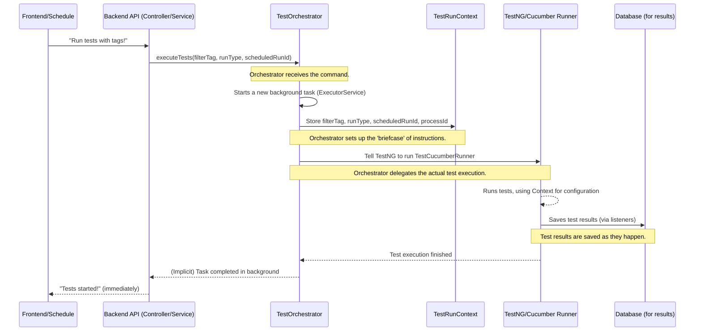

# Chapter 3: Test Execution Orchestrator

Welcome back to `lenstest`! In [Chapter 1: Frontend Test Dashboard](01_frontend_test_dashboard_.md), you learned about seeing your test results, and in [Chapter 2: Scheduled Test Management](02_scheduled_test_management_.md), we explored how to make your tests run automatically at specific times.

Now, let's think: when you click "Run Tests" on the dashboard, or when your nightly schedule ticks over to 2:00 AM, what actually *does* the work of starting those tests? Who's the boss that takes your request and makes sure the tests run correctly?

That's the job of the **Test Execution Orchestrator**!

## What Problem Does it Solve?

Imagine you're trying to throw a big party. You might have a guest list, a menu, and a schedule for when things should happen. But you don't actually cook all the food yourself or play all the music. Instead, you tell the caterer what to cook, and you tell the DJ what music to play. You're the **orchestrator** of the party!

In `lenstest`, the **Test Execution Orchestrator** is like that party planner for your tests. It solves the problem of needing a central brain to:

1.  **Receive commands**: "Run tests!" (either from you manually or from a schedule).
2.  **Understand requests**: "Run *which* tests? All of them? Only the 'smoke' tests? Only the 'critical' tests?"
3.  **Prepare the environment**: Make sure everything is ready before the tests start.
4.  **Delegate the actual work**: It doesn't run the tests itself; it tells another specialized component (our Cucumber test runner) to do the actual heavy lifting.
5.  **Ensure correct setup**: It makes sure the test runner starts with the exact instructions (like which tags to run).

Without the Orchestrator, other parts of `lenstest` would have to know all the complex details of how to start tests, which would make the system messy and hard to manage.

## A Simple Use Case: Starting Smoke Tests

Let's say you've just made a small change to your software and you want to quickly run your "smoke tests" – a small set of important tests that check if the main features are working. You go to the `lenstest` dashboard and click a button that says "Run Smoke Tests."

Here's how the Orchestrator steps in:

1.  The dashboard tells the backend: "Run tests, and only include tests with the `@smoke` tag."
2.  The backend then hands this request over to the **Test Execution Orchestrator**.
3.  The Orchestrator understands: "Okay, `@smoke` tests, run them now!"
4.  It prepares everything internally.
5.  Then, it tells the **Cucumber test runner** (which we'll cover in [Chapter 4: Cucumber BDD Test Framework](04_cucumber_bdd_test_framework_.md)): "Start running tests, but only the ones tagged `@smoke`."
6.  The Cucumber runner starts executing those specific tests.

## Key Concepts of the Orchestrator

The Test Execution Orchestrator handles a few core ideas to do its job:

1.  **Central Dispatcher**: It's the single point of contact for starting any test run in `lenstest`. Whether it's a manual click or a scheduled alarm, all requests go through here.
2.  **Test Filters (Tags)**: It understands how to pick specific tests. We use "tags" (like `@smoke` or `@regression`) to label our tests. The Orchestrator takes these tags and uses them to tell the test runner *which* tests to include or exclude.
3.  **Run Type**: It keeps track of *why* a test run was started. Was it `MANUAL` (you clicked a button) or `SCHEDULED` (an automatic cron job)? This helps `lenstest` keep good records.
4.  **Execution Context (`TestRunContext`)**: Before tests start, the Orchestrator creates a small "briefcase" of information (`TestRunContext`). This briefcase contains important details like the filter tags, the run type, and a unique ID for the current test run. This information is then available to other parts of `lenstest` as the tests run.
5.  **Delegation to TestNG/Cucumber**: The Orchestrator itself doesn't know *how* to execute a single test step. Instead, it delegates this job to `TestNG` (a test framework) which in turn uses our `TestCucumberRunner` to execute the actual Cucumber tests. This is like a project manager giving tasks to specialized team members.
6.  **Asynchronous Execution**: To keep `lenstest` responsive, the Orchestrator doesn't run tests directly in the same flow. Instead, it starts tests in a separate "background thread." This means you can click "Run Tests" and immediately go back to interacting with the dashboard, while the tests hum along in the background.

## How to Use It: Triggering a Test Run

As a user or even from other services within `lenstest` (like the `ScheduledRunService`), you don't directly write code for the Orchestrator. Instead, you call its methods.

### Example: Running Smoke Tests Manually (from the Frontend)

When you click a button on the [Frontend Test Dashboard](01_frontend_test_dashboard_.md) to run tests, here's what happens from a code perspective in the backend:

```java
// src/main/java/com/db/lenstest/controller/TestExecutionController.java
// ... other imports ...
import com.db.lenstest.service.TestOrchestrator; // Import our Orchestrator

@RestController
@RequestMapping("/api/tests")
@CrossOrigin(origins = "*")
public class TestExecutionController {

    @Autowired
    private TestOrchestrator orchestrator; // Spring automatically gives us the Orchestrator

    // This endpoint handles requests from the dashboard to start tests
    @PostMapping("/execute")
    public String executeTests(@RequestBody TestRunRequest requestBody) {
        // The requestBody contains details like the filter tag (e.g., "@smoke")
        String tag = requestBody.fetchTestExpression();
        
        // This is where the Orchestrator is told to start the tests!
        orchestrator.executeTests(tag); 
        
        return "Tests started for tag: " + tag;
    }

    // ... other endpoints ...
}
```
In this snippet, the `TestExecutionController` acts as a receptionist for requests from the web dashboard. When an `HTTP POST` request comes to `/api/tests/execute`, it takes the test tag (like "@smoke") from the request and simply tells `orchestrator.executeTests(tag);` to do its job.

### Example: Triggering Scheduled Tests (from ScheduledRunService)

From [Chapter 2: Scheduled Test Management](02_scheduled_test_management_.md), we saw how `ScheduledRunService` manages automated test runs. When a scheduled time arrives, it also calls the Orchestrator:

```java
// src/main/java/com/db/lenstest/service/ScheduledRunService.java
// ... other imports ...
import com.db.lenstest.lensDTO.RunType; // To specify if it's a scheduled run
import com.db.lenstest.service.TestOrchestrator; // Import our Orchestrator

@Service
public class ScheduledRunService {

    // ... other autowired services ...
    @Autowired private TestOrchestrator testOrchestrator; // Get the Orchestrator

    private void scheduleTask(ScheduledRunEntity entity) {
        // ... code to create a Runnable task that triggers when the schedule is due ...

        Runnable task = () -> {
            log.info("Executing scheduled run: " + entity.getName());
            String testExpression = createTestExpression(entity.getIncludeTags(), entity.getExcludeTags());
            
            // Here, the Orchestrator is called with more details:
            // - testExpression (like "@critical")
            // - RunType.SCHEDULED (because it's a scheduled run)
            // - entity.getId() (the ID of the specific schedule that triggered it)
            testOrchestrator.executeTests(testExpression, RunType.SCHEDULED, entity.getId()); 
            
            // ... update last run time in database ...
        };

        // ... code to schedule the task with the TaskScheduler ...
    }
    // ... other methods ...
}
```
Here, the `ScheduledRunService` uses a slightly more detailed call to `testOrchestrator.executeTests()`, providing the `RunType.SCHEDULED` and the `scheduledRunId`. This helps `lenstest` keep a rich record of how each test run was initiated.

## Under the Hood: How the Orchestrator Works

Let's look behind the curtain to understand how the `TestOrchestrator` takes these requests and turns them into actual test runs.

### The Request Flow

When `TestExecutionController` or `ScheduledRunService` tells the Orchestrator to run tests, here's the simplified sequence of events:



1.  **Source (Frontend/Schedule)** makes a request.
2.  **Backend (Controller/Service)** receives it and calls the `TestOrchestrator`.
3.  The **TestOrchestrator** gets the command `executeTests()` with details like tags and run type.
4.  It immediately sets up a new background task. This means the Orchestrator can quickly reply that tests have *started*, even though they are still running in the background.
5.  Inside this background task, the Orchestrator first populates a special `TestRunContext`. This is like writing down instructions on a sticky note that any part of the test runner can read.
6.  Then, the Orchestrator uses `TestNG` (a popular Java testing framework) to start our `TestCucumberRunner`. This tells `TestNG`: "Please run the tests defined by our `TestCucumberRunner`."
7.  The **TestNG/Cucumber Runner** then takes over, reads the `TestRunContext` to know *which* tags to filter, and starts executing the actual Cucumber tests.
8.  As tests run, their results are captured and sent to the **Database**.
9.  Once all tests are done, the Cucumber Runner finishes, and the background task created by the Orchestrator also completes.

### The Code Behind the Scenes

Let's look at the core of the `TestOrchestrator` to see how it performs these steps.

```java
// src/main/java/com/db/lenstest/service/TestOrchestrator.java
package com.db.lenstest.service;

import com.db.lenstest.lensDTO.RunType;
import com.db.lenstest.listener.TestRunContext; // The 'briefcase' for test info
import com.db.lenstest.runner.TestCucumberRunner; // Our custom Cucumber runner
import lombok.extern.slf4j.Slf4j;
import org.testng.TestNG; // The main TestNG framework
import org.springframework.beans.factory.annotation.Autowired;
import org.springframework.stereotype.Service;
import java.util.concurrent.ExecutorService; // For running tasks in background
import java.util.concurrent.Executors;

@Service // Marks this as a Spring Service
@Slf4j
public class TestOrchestrator {

    // A pool of threads to run tasks in the background, max 10 at a time
    private final ExecutorService executor = Executors.newFixedThreadPool(10);
    
    @Autowired
    private TestRunCleanupService cleanupService; // Used to get current process ID

    // This is the main method called to start tests manually
    public void executeTests(String filterTag) {
        // Calls the more detailed method, defaulting to MANUAL run type
        executeTests(filterTag, RunType.MANUAL, null);
    }
    
    // This is the detailed method called by both manual and scheduled runs
    public void executeTests(String filterTag, RunType runType, String scheduledRunId) {
        // Submitting a task to the executor makes it run in a new thread
        executor.submit(() -> { // This whole block runs in the background
            try {
                // 1. Set execution context (fill the 'briefcase')
                TestRunContext.put("filterTag", filterTag);
                TestRunContext.put("runType", runType);
                TestRunContext.put("scheduledRunId", scheduledRunId);
                TestRunContext.put("processId", cleanupService.getCurrentProcessId());
                
                // 2. Delegate to TestNG to start the Cucumber runner
                TestNG testNG = new TestNG();
                testNG.setTestClasses(new Class[]{TestCucumberRunner.class}); // Tell TestNG to run our Cucumber setup
                testNG.setUseDefaultListeners(false); // We have our own custom listeners
                testNG.run(); // Start the tests!
                
            } catch (Exception e) {
                // Log any errors that happen during test setup or execution
                log.error("Error executing tests: " + e.getMessage(), e);
            }
        });
    }
}
```

Let's break down the important parts of the `TestOrchestrator`:

1.  **`executor.submit(() -> { ... });`**:
    *   This is crucial for **Asynchronous Execution**. It wraps the entire test execution logic in a `Runnable` (a piece of code that can be run) and submits it to an `ExecutorService`.
    *   The `ExecutorService` then picks up this task and runs it in a separate thread. This prevents `lenstest` from freezing while tests are running.

2.  **`TestRunContext.put(...)`**:
    *   Before starting the actual tests, the Orchestrator carefully places all the important details (like `filterTag`, `runType`, `scheduledRunId`, and the `processId`) into `TestRunContext`.
    *   Think of `TestRunContext` as a shared temporary storage. Any other part of the test execution (like the listener that saves results to the database) can easily look into this "briefcase" to get the current run's information.

3.  **`TestNG testNG = new TestNG(); testNG.setTestClasses(new Class[]{TestCucumberRunner.class}); testNG.run();`**:
    *   This is the **Delegation** step. `TestNG` is a powerful, flexible testing framework in Java. We're telling it: "Hey `TestNG`, I want you to manage the running of my `TestCucumberRunner`."
    *   `TestCucumberRunner` is where we've configured how to run our BDD tests using Cucumber. So, the Orchestrator doesn't directly call Cucumber; it tells `TestNG` to call our specialized Cucumber runner.

### The TestRunContext Explained

`TestRunContext` is a simple yet powerful concept. It ensures that critical information about the current test run is available whenever and wherever it's needed during the test execution process.

Imagine a single "message board" for the current test run:

| Field          | Description                                                                     | Example Value    |
| :------------- | :------------------------------------------------------------------------------ | :--------------- |
| `filterTag`    | Which specific tests (by tag) should be run.                                    | `@smoke`         |
| `runType`      | Was this run `MANUAL` (user started) or `SCHEDULED` (automated)?                | `MANUAL`         |
| `scheduledRunId` | If `SCHEDULED`, which specific scheduled configuration triggered it.          | `scheduled-run-001` |
| `processId`    | A unique ID for the `lenstest` application instance currently running tests.    | `12345@my-server` |

The `TestOrchestrator` writes this information to the `TestRunContext` at the very beginning, and then components like our real-time results listener can read from it to correctly tag and store the results in the database.

## Conclusion

The **Test Execution Orchestrator** is the unsung hero of `lenstest`. It acts as the central command center, taking requests to run tests (whether manual or scheduled), applying filters like tags, setting up the necessary context, and then gracefully delegating the actual test execution to our underlying test frameworks. It ensures that every test run starts correctly and with the right configuration, keeping the entire system organized and efficient.

Now that we understand how test runs are initiated, the next logical step is to dive into the component that actually executes the tests: our [Cucumber BDD Test Framework](04_cucumber_bdd_test_framework_.md)!

---

<sub><sup>Generated by [AI Codebase Knowledge Builder](https://github.com/The-Pocket/Tutorial-Codebase-Knowledge).</sup></sub> <sub><sup>**References**: [[1]](https://github.com/amangupta0709/lenstest/blob/1105aa93ea0a8c60528ac519e6b0525f06c79c72/src/main/java/com/db/lenstest/controller/TestExecutionController.java), [[2]](https://github.com/amangupta0709/lenstest/blob/1105aa93ea0a8c60528ac519e6b0525f06c79c72/src/main/java/com/db/lenstest/service/TestOrchestrator.java), [[3]](https://github.com/amangupta0709/lenstest/blob/1105aa93ea0a8c60528ac519e6b0525f06c79c72/src/main/java/com/db/lenstest/service/TestRunManagementExample.java)</sup></sub>