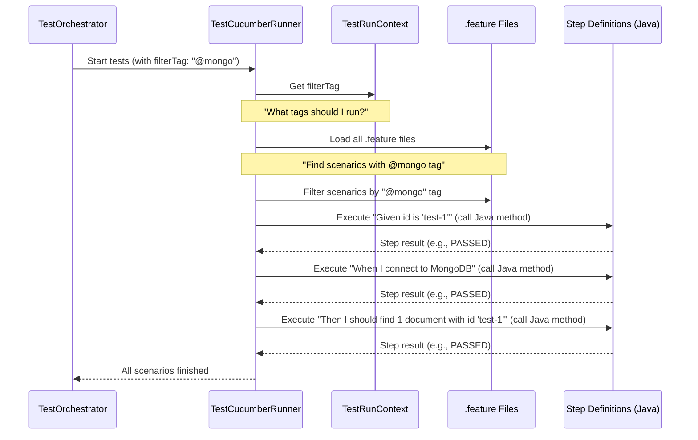

# Chapter 4: Cucumber BDD Test Framework

Welcome back to `lenstest`! In [Chapter 3: Test Execution Orchestrator](03_test_execution_orchestrator_.md), we learned about the "brain" that receives commands and starts test runs. But what *is* the actual test engine that runs your tests? What if you want to write tests that are so clear, even someone without coding experience can understand them?

This is where the **Cucumber BDD Test Framework** comes into play! It's the core engine in `lenstest` that lets you define and run tests in a very special, easy-to-read way.

## What Problem Does it Solve?

Imagine you're building a new feature for your software, like a new "login" page. The product owner (who understands what the user wants) and the developers (who build the code) need to agree on what "login successfully" actually means. If the tests are only written in complex code, it's hard for everyone to be on the same page.

Cucumber solves this by allowing tests to be written in a plain language format called **Gherkin**. This format uses simple words like `Given`, `When`, and `Then`, making your test cases read like plain English sentences.

This approach, known as **Behavior-Driven Development (BDD)**, helps to:

*   **Improve Communication:** Everyone involved (developers, testers, business analysts) can understand the test requirements because they are written in a common language.
*   **Create Clear Specifications:** Tests become living documentation of how your software should behave.
*   **Focus on Behavior:** Instead of testing tiny pieces of code, you test the overall *behavior* of the system from a user's perspective.

## A Simple Use Case: Verifying MongoDB Connectivity

Let's imagine `lenstest` needs to ensure it can always connect to its database (MongoDB). This is a critical check!

With Cucumber, we can write a test like this:

```gherkin
@mongo @integration @smoke
Feature: MongoDB Connection Verification
  As a system administrator
  I want to verify MongoDB connectivity
  So that I can ensure database operations will work

  Scenario: Successful MongoDB connection
    Given id is "test-1"
    When I connect to MongoDB
    And I insert a test document with id "test-1"
    Then I should find 1 document with id "test-1"
    And I should be able to delete the document with id "test-1"
```

This test clearly states *what* we want to achieve ("MongoDB Connection Verification"), *who* wants it ("As a system administrator"), and *why* ("So that I can ensure database operations will work"). The `Scenario` then describes a specific example of this behavior, step-by-step, in plain language.

## Key Concepts of Cucumber BDD

Let's break down the important pieces of Cucumber:

1.  **Gherkin (`.feature` files)**:
    *   This is the special language used to write your tests. It uses keywords like `Feature`, `Scenario`, `Given`, `When`, `Then`, and `And`.
    *   Tests written in Gherkin are stored in files ending with `.feature`.
    *   **Example (from `src/main/resources/features/mongo_connection.feature`):**
        ```gherkin
        Feature: MongoDB Connection Verification
          Scenario: Successful MongoDB connection
            Given id is "test-1"
            When I connect to MongoDB
            And I insert a test document with id "test-1"
            Then I should find 1 document with id "test-1"
        ```
        This snippet shows a `Feature` (the main goal), and a `Scenario` (a specific test case) with `Given-When-Then` steps.

2.  **Steps (Step Definitions)**:
    *   Gherkin steps are just plain text. They don't *do* anything on their own.
    *   **Step Definitions** are Java code methods that "listen" for these Gherkin steps. When Cucumber sees a `When I connect to MongoDB` step, it looks for a Java method that matches this text.
    *   These Java methods contain the actual code that performs actions, like connecting to a database or checking a value.
    *   **Example (from `src/main/java/com/db/lenstest/steps/MongoConnectionSteps.java`):**
        ```java
        // Inside MongoConnectionSteps.java
        // ... (other code) ...

        @When("I connect to MongoDB")
        public void connectToMongoDB() {
            // This code runs when Cucumber sees "When I connect to MongoDB"
            try {
                mongoTemplate.getDb().listCollectionNames().first(); // Try to get collection names
                connectionSuccess = true;
            } catch (Exception e) {
                connectionError = e; // Capture any error
                connectionSuccess = false;
            }
        }

        @Then("I should find {int} document with id {string}")
        public void iShouldFindDocumentWithId(int expectedCount, String id) {
            // This code runs when Cucumber sees "Then I should find X document with id Y"
            long count = repository.findById(id).stream().count();
            assertEquals(expectedCount, count); // Check if the count matches
        }
        ```
        Notice how `@When` and `@Then` link the plain English text to the Java code. The `{int}` and `{string}` parts are special; they tell Cucumber to extract numbers and text from the Gherkin step and pass them as arguments to the Java method!

3.  **Tags**:
    *   These are labels (like `@mongo`, `@smoke`, `@integration`) that you can add to your `Feature` or `Scenario` in the `.feature` file.
    *   They help you organize your tests and selectively run only a specific group of tests. For example, if you only want to run `@smoke` tests, `lenstest` can use this tag to pick just those scenarios.

4.  **Cucumber Runner (`TestCucumberRunner`)**:
    *   This is a special class that acts as the bridge between your `.feature` files and your `Step Definitions`.
    *   It's responsible for finding all `.feature` files, linking their steps to the correct Java code, and then executing them.
    *   In `lenstest`, we use `TestNG` (another testing framework) to help run our Cucumber tests in parallel, which means multiple tests can run at the same time to save time!

## How to Use It: Running Our MongoDB Connectivity Test

When the [Test Execution Orchestrator](03_test_execution_orchestrator_.md) (from Chapter 3) gets a command like "Run tests with tag `@mongo`," here's what happens:

1.  The Orchestrator sets up the environment and then tells `TestNG` to start our `TestCucumberRunner`.
2.  `TestCucumberRunner` starts up. It looks into a temporary "briefcase" ([Test Run Context](03_test_execution_orchestrator_.md)) for the `filterTag` (which would be `@mongo` in our example).
3.  It then scans all `.feature` files to find scenarios that have the `@mongo` tag.
4.  For each matching scenario (like "Successful MongoDB connection"), it goes through each `Given`, `When`, `Then`, `And` step.
5.  For each step, it finds the corresponding Java method in our `MongoConnectionSteps` class (or other step definition classes).
6.  It executes that Java method. If the Java code runs without errors and all `assert` statements pass, the step is marked as "Passed." If an error occurs, the step (and scenario) is marked "Failed."
7.  All these results are collected and sent back to `lenstest` for reporting.

You don't directly "use" Cucumber as a separate tool in `lenstest`; rather, `lenstest` uses Cucumber internally. Your job as a test writer is to create the `.feature` files and the corresponding `Steps` classes.

## Under the Hood: How Cucumber Works in `lenstest`

Let's peek behind the curtain to see how `lenstest` brings all these Cucumber pieces together.

### The Execution Flow

When the [Test Execution Orchestrator](03_test_execution_orchestrator_.md) tells `TestNG` to start the `TestCucumberRunner`, here's a simplified sequence:



1.  The `TestOrchestrator` triggers our `TestCucumberRunner`.
2.  The `TestCucumberRunner` immediately checks the `TestRunContext` (the temporary "briefcase") to see if there's a `filterTag` (like `@mongo`) for the current run.
3.  It then reads all your `.feature` files and applies the `filterTag` to find only the relevant `Scenarios`.
4.  For each step in a matching `Scenario`, the `TestCucumberRunner` finds and executes the corresponding Java method in your `Steps` classes.
5.  As each step runs, its result (Pass/Fail) is processed.
6.  Once all filtered scenarios are executed, `TestCucumberRunner` signals that the test run is complete.

### The Code Behind the Scenes

Let's look at the `TestCucumberRunner` and `CucumberConfig` in `lenstest` to understand how they are set up.

First, our main Cucumber runner configuration:

```java
// src/main/java/com/db/lenstest/runner/TestCucumberRunner.java
package com.db.lenstest.runner;

import com.db.lenstest.listener.TestRunContext; // To get the filterTag
import io.cucumber.testng.AbstractTestNGCucumberTests;
import io.cucumber.testng.CucumberOptions; // Key Cucumber configuration
import io.cucumber.testng.PickleWrapper;
import io.cucumber.tagexpressions.TagExpressionParser; // For understanding tag filters
import org.testng.annotations.DataProvider;
import java.util.Arrays;

@CucumberOptions(
        features = "classpath:features", // Where to find our .feature files
        glue = {"com.db.lenstest.config", "com.db.lenstest.steps", "com.db.lenstest.hooks"}, // Where to find our Java step definitions
        plugin = {
                "pretty",
                "com.db.lenstest.listener.CustomCucumberListener", // Our special listener for results
        }
)
public class TestCucumberRunner extends AbstractTestNGCucumberTests {

    @Override
    @DataProvider(parallel = true) // Run tests in parallel!
    public Object[][] scenarios() {
        // Get the dynamic filter tag set by the Orchestrator
        String dynamicTags = (String) TestRunContext.get("filterTag");

        // If a filter tag is present, filter the scenarios
        if (dynamicTags != null && !dynamicTags.isEmpty()) {
            Object[][] allScenarios = super.scenarios(); // Get all scenarios first
            // Filter them based on the dynamicTags using Cucumber's tag parser
            return (Arrays.stream(allScenarios)
                    .filter(scenario -> TagExpressionParser.parse(dynamicTags)
                            .evaluate(((PickleWrapper) scenario[0]).getPickle().getTags()))
                    .toList())
                    .toArray(new Object[0][0]);
        }
        else {
            return super.scenarios(); // No filter? Run all scenarios
        }
    }
}
```
This `TestCucumberRunner` class is the heart of `lenstest`'s BDD execution.
*   The `@CucumberOptions` annotation is crucial:
    *   `features = "classpath:features"` tells Cucumber where to find your Gherkin `.feature` files.
    *   `glue = { ... }` tells Cucumber where to find your Java `Steps` classes (step definitions) and other helper code (`hooks`).
    *   `plugin = { ... "CustomCucumberListener" ... }` mentions a special `CustomCucumberListener`. This is a vital part of `lenstest` that listens to every step, scenario, and feature as it runs and sends the results to the database for reporting! (More on this in [Chapter 6: Real-time Results Reporting (SSE)](06_real_time_results_reporting__sse__.md)).
*   The `scenarios()` method is overridden to implement dynamic filtering. It retrieves the `filterTag` from `TestRunContext` and uses `TagExpressionParser` to include only the scenarios that match the provided tag. This is how `lenstest` runs only `@smoke` tests or `@critical` tests when you ask for them.

Next, how `lenstest` allows Spring (our backend framework) to work with Cucumber:

```java
// src/main/java/com/db/lenstest/config/CucumberConfig.java
package com.db.lenstest.config;

import com.db.lenstest.LenstestApplication;
import io.cucumber.spring.CucumberContextConfiguration; // Important for Spring integration
import org.springframework.boot.test.context.SpringBootTest;
import org.springframework.test.context.ContextConfiguration;

@CucumberContextConfiguration // Tells Cucumber to use Spring for context
@SpringBootTest // Boots up our Spring application for tests
@ContextConfiguration(classes = LenstestApplication.class) // Specifies which Spring app to use
public class CucumberConfig {
    // This class enables Spring's dependency injection within our Cucumber step definitions.
    // This means you can @Autowired services like MongoTemplate or your repositories
    // directly into your step definition classes (like MongoConnectionSteps.java)!
}
```
The `CucumberConfig` class is simple but powerful. By adding `@CucumberContextConfiguration`, `@SpringBootTest`, and `@ContextConfiguration`, we tell Cucumber to use Spring's powerful dependency injection. This is why in `MongoConnectionSteps.java`, you can simply `@Autowired private MongoTemplate mongoTemplate;` and Spring automatically provides the database connection object for your test steps!

## Conclusion

In this chapter, we unpacked the **Cucumber BDD Test Framework** – the engine that powers our tests in `lenstest`. We learned how to write clear, human-readable tests using Gherkin in `.feature` files, connect them to executable Java code in `Steps` classes, and use tags for flexible test selection. We saw how `TestCucumberRunner` orchestrates this process, using `TestRunContext` for dynamic filtering and integrating seamlessly with Spring for powerful dependency injection.

This framework allows `lenstest` to execute tests based on plain language behavior descriptions, making your test suite understandable and maintainable for everyone. Next, we'll dive into [Chapter 5: Test Run Lifecycle Management](05_test_run_lifecycle_management__.md) to understand what happens to all the results generated by these tests!

---

<sub><sup>Generated by [AI Codebase Knowledge Builder](https://github.com/The-Pocket/Tutorial-Codebase-Knowledge).</sup></sub> <sub><sup>**References**: [[1]](https://github.com/amangupta0709/lenstest/blob/1105aa93ea0a8c60528ac519e6b0525f06c79c72/src/main/java/com/db/lenstest/config/CucumberConfig.java), [[2]](https://github.com/amangupta0709/lenstest/blob/1105aa93ea0a8c60528ac519e6b0525f06c79c72/src/main/java/com/db/lenstest/runner/TestCucumberRunner.java), [[3]](https://github.com/amangupta0709/lenstest/blob/1105aa93ea0a8c60528ac519e6b0525f06c79c72/src/main/java/com/db/lenstest/service/FeatureFilesParser.java), [[4]](https://github.com/amangupta0709/lenstest/blob/1105aa93ea0a8c60528ac519e6b0525f06c79c72/src/main/java/com/db/lenstest/steps/MongoConnectionSteps.java), [[5]](https://github.com/amangupta0709/lenstest/blob/1105aa93ea0a8c60528ac519e6b0525f06c79c72/src/main/resources/features/mongo_connection.feature)</sup></sub>