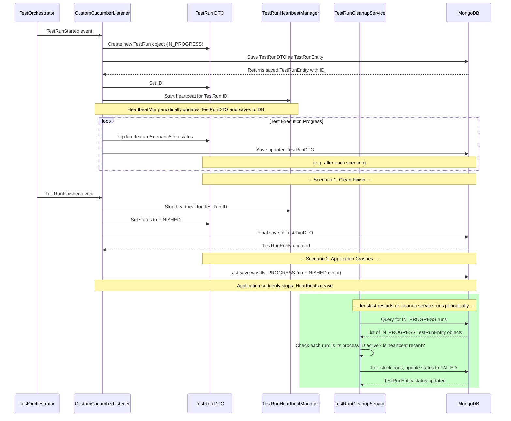

# Chapter 5: Test Run Lifecycle Management

Welcome back to `lenstest`! In [Chapter 4: Cucumber BDD Test Framework](04_cucumber_bdd_test_framework_.md), we explored how our tests are written in a human-readable format and then executed by Cucumber. We saw how individual steps, scenarios, and features run.

But after a test run is started by the [Test Execution Orchestrator](03_test_execution_orchestrator_.md), and Cucumber begins churning through the steps, how does `lenstest` keep track of everything that's happening? How does it know if a run is still active, if it passed or failed, or if it unexpectedly stopped midway?

This is where **Test Run Lifecycle Management** comes in! It's the system that watches over each test execution from the moment it begins until it's completely finished, making sure we always have accurate information about its status.

## What Problem Does it Solve?

Imagine you've started a massive suite of tests, which might take an hour to complete. What if, halfway through, your `lenstest` application crashes, or the server it's running on loses power? The tests would stop, but the dashboard might still show them as "In Progress" forever, giving you misleading information. This is a common problem in automated testing!

Test Run Lifecycle Management solves this by:

1.  **Providing a "source of truth"**: A central record (`TestRun` object) that accurately reflects the current state of an executing test.
2.  **Tracking progress**: Continuously updating the status of features, scenarios, and individual steps as they run.
3.  **Detecting "stuck" runs**: Identifying test runs that started but unexpectedly stopped, and automatically marking them as failed.
4.  **Ensuring data integrity**: Making sure that even if things go wrong, your test history remains reliable.

It's like having a meticulous foreman on a construction site who not only records every task's progress but also notices if a worker suddenly stops and doesn't return, then follows up to mark that task as incomplete or failed.

## A Simple Use Case: Auto-Failing a Crashed Test Run

Let's walk through a common problem: a test run starts, and then `lenstest` crashes unexpectedly.

Here’s the ideal outcome we want from lifecycle management:

1.  A test run is started. Its status is `IN_PROGRESS`.
2.  `lenstest` crashes (e.g., due to a power cut).
3.  When `lenstest` restarts, it should automatically detect that the previous run was left unfinished and mark it as `FAILED`, instead of leaving it forever `IN_PROGRESS`.

This prevents "ghost runs" that clutter your dashboard and give false information.

## Key Concepts of Test Run Lifecycle Management

To achieve this, `lenstest` uses several important concepts:

1.  **`TestRun` Objects (DTOs and Entities)**:
    *   Think of a `TestRun` object as a detailed logbook for a single test execution. It contains all the information: when it started, its current overall status (`IN_PROGRESS`, `FINISHED`, `FAILED`), and detailed breakdowns of all features, scenarios, and steps, including their individual statuses and any error messages.
    *   There are two forms: a `TestRun` (Data Transfer Object or DTO) which is used in memory while tests are running, and a `TestRunEntity` which is the database-friendly version saved to [MongoDB](07_mongodb_persistence_layer_.md).

2.  **Continuous Status Updates**:
    *   As Cucumber runs tests, `lenstest` continuously updates the `TestRun` object. Every time a scenario starts, a step finishes, or an error occurs, the `TestRun` object is updated in memory and then saved to the database. This ensures the dashboard always shows the most current status.

3.  **"Heartbeats"**:
    *   To know if a test run is truly active, `lenstest` periodically sends out a "heartbeat." This is just a timestamp (`lastHeartbeat`) within the `TestRun` object that gets updated every few minutes. It's like a pulse – if the heartbeats stop, the run might be stuck.

4.  **Process ID**:
    *   Each running `lenstest` application has a unique `processId`. When a `TestRun` starts, it records this `processId`. This helps `lenstest` know *which* instance of the application started a particular run.

5.  **Cleanup Actions**:
    *   Services periodically check for `IN_PROGRESS` runs that are either very old, or whose `processId` no longer corresponds to an active `lenstest` application. If such runs are found, they are automatically marked as `FAILED` with a reason (e.g., "Application restart" or "Run exceeded maximum duration").

## How to Use It: The System Manages It for You

As a user, you don't directly "use" these lifecycle management features. Instead, they operate automatically in the background to ensure the reliability of your test results.

When you see a test run's status change on the dashboard, or when a seemingly stuck run suddenly turns red and says "Failed (Application Restart)", that's Test Run Lifecycle Management at work!

## Under the Hood: How Lifecycle Management Works

Let's look behind the scenes at how `lenstest` manages the lifecycle of a test run.

### The Lifecycle Flow

Here’s a simplified sequence of events for a test run, including what happens if the application crashes:



1.  **Test Run Starts**: The [Test Execution Orchestrator](03_test_execution_orchestrator_.md) initiates a run, triggering a `TestRunStarted` event.
2.  **`CustomCucumberListener` Creates `TestRun`**: Our `CustomCucumberListener` (from [Chapter 4](04_cucumber_bdd_test_framework_.md)) creates a `TestRun` DTO, sets its initial status to `IN_PROGRESS`, and records the `processId` of the current `lenstest` instance. It then saves this `TestRun` as a `TestRunEntity` to the [MongoDB database](07_mongodb_persistence_layer_.md).
3.  **Heartbeat Manager Starts**: The `CustomCucumberListener` also tells the `TestRunHeartbeatManager` to start sending regular "heartbeats" for this specific run. The `HeartbeatManager` will then periodically update the `lastHeartbeat` timestamp on the `TestRun` object and save it to the database.
4.  **Progress Updates**: As tests execute (scenarios start, steps finish), the `CustomCucumberListener` continuously updates the `TestRun` DTO (e.g., incrementing passed step counts, setting scenario status) and saves the changes to MongoDB.
5.  **Clean Finish**: If the test run completes successfully, the `TestRunFinished` event occurs. The `CustomCucumberListener` stops the heartbeat, sets the `TestRun` status to `FINISHED`, and performs a final save to MongoDB.
6.  **Application Crashes (Unhandled Stop)**: If `lenstest` crashes before the `TestRunFinished` event, the `TestRun` in the database remains `IN_PROGRESS`, and the heartbeats stop.
7.  **`TestRunCleanupService` to the Rescue**: The `TestRunCleanupService` (which runs periodically and also on application startup) queries the database for all runs that are `IN_PROGRESS`. For each such run, it checks:
    *   Is the run from a *different* `processId` than the current `lenstest` instance? (Meaning a previous instance crashed)
    *   If it's from the current `processId`, has its `lastHeartbeat` been updated recently? (If not, the current instance might be stuck, or the cleanup service itself might be the only thing running after a crash).
    *   It might also check if the operating system process corresponding to the `processId` is still alive.
8.  **Marking as `FAILED`**: If a run is deemed "stuck" or "orphaned" by these checks, the `TestRunCleanupService` updates its `executionStage` to `FAILED` in the database, along with a descriptive reason. This makes sure your dashboard reflects the true state of affairs.

### The Code Behind the Scenes

Let's look at some key components that implement this lifecycle management.

#### 1. The `TestRun` DTO

This is the central data object that holds all the information about a test run while it's in progress.

```java
// src/main/java/com/db/lenstest/lensDTO/TestRun.java
@Data // Lombok automatically adds getters, setters, etc.
public class TestRun {
    private String id;
    private LocalDateTime startedAt;
    private LocalDateTime completedAt;
    private String executionStage = ExecutionStage.IN_PROGRESS; // Current status
    private String filterTag; // Tags used for this run
    private ConcurrentHashMap<String,Feature> features = new ConcurrentHashMap<>(); // All features in this run
    // ... stats for features, scenarios, steps, tags ...
    private RunType runType = RunType.MANUAL;
    private String scheduledRunId; // If it was a scheduled run
    private String processId; // Unique ID of the lenstest instance
    private volatile LocalDateTime lastHeartbeat; // The 'pulse' of the run

    public TestRunEntity toEntity(){
        return TestRunEntityMapper.toEntity(this); // Converts to DB-friendly entity
    }
    
    // Called periodically by HeartbeatManager
    public void updateHeartbeat() {
        this.lastHeartbeat = LocalDateTime.now();
    }

    public void initialValues(RunType runType, String scheduledRunId, String processId) {
        this.runType = runType;
        this.scheduledRunId = scheduledRunId;
        this.processId = processId;
        this.startedAt = LocalDateTime.now();
        this.lastHeartbeat = LocalDateTime.now(); // Initial heartbeat
    }
    // ... methods to update stats, set completion time, etc. ...
}
```
The `TestRun` DTO is where all the dynamic information about a running test is stored. Notice `executionStage`, `processId`, and especially `lastHeartbeat`, which are crucial for lifecycle management. The `toEntity()` method converts this in-memory object into a `TestRunEntity` for saving to MongoDB.

#### 2. The `CustomCucumberListener` (The Updater)

This listener actively updates the `TestRun` DTO and saves it to the database at key points.

```java
// src/main/java/com/db/lenstest/listener/CustomCucumberListener.java
// ... imports ...
public class CustomCucumberListener implements ConcurrentEventListener {
    TestRun testRun = new TestRun(); // The DTO for the current run
    // ... autowired services for DB, cleanup, heartbeat ...

    private void runStarted(TestRunStarted event) {
        // Get run context from Orchestrator (Chapter 3)
        String processId = (String) TestRunContext.get("processId");
        testRun.initialValues(runType, scheduledRunId, processId); // Set initial values
        
        // Save to DB and then start heartbeat
        testRunEntityRepository
                .save(testRun.toEntity())
                .doOnSuccess(entity -> {
                    testRun.setId(entity.getId()); // Get the ID generated by DB
                    // Start heartbeat, passing a callback to update TestRun DTO
                    heartbeatManager.startHeartbeat(entity.getId(), () -> {
                        testRun.updateHeartbeat(); // Update heartbeat in DTO
                    });
                })
                .subscribe(); // Execute the reactive flow
    }

    private void ScenarioFinished(TestCaseFinished event) {
        // ... update scenario status, feature status, tag stats in testRun DTO ...
        
        // Save updated testRun DTO to DB after each scenario
        testRunEntityRepository.save(testRun.toEntity())
                .doOnSuccess(ResultPublisher::publish) // Also publish for real-time (Chapter 6)
                .subscribe();
    }
    
    private void runFinished(TestRunFinished event) {
        // Stop heartbeat monitoring
        if (testRun.getId() != null) {
            heartbeatManager.stopHeartbeat(testRun.getId());
        }
        testRun.setCompletedAt(LocalDateTime.now());
        testRun.setExecutionStage(ExecutionStage.FINISHED); // Mark as FINISHED
        
        // Final save to DB
        testRunEntityRepository.save(testRun.toEntity()).subscribe();
    }
    // ... other methods for stepStarted, stepFinished, etc. ...
}
```
This snippet shows how the listener initializes the `TestRun` DTO, saves it, starts the heartbeat, continuously updates it (e.g., after each `ScenarioFinished`), and finally marks it as `FINISHED`. The `testRunEntityRepository.save()` calls are crucial for persisting these updates.

#### 3. The `TestRunHeartbeatManager` (The Pulse Checker)

This service manages the periodic updates of the `lastHeartbeat` timestamp.

```java
// src/main/java/com/db/lenstest/service/TestRunHeartbeatManager.java
@Service
@Slf4j
public class TestRunHeartbeatManager {
    private final ScheduledExecutorService heartbeatExecutor;
    private final ConcurrentHashMap<String, HeartbeatTask> activeHeartbeats;

    public TestRunHeartbeatManager() {
        this.heartbeatExecutor = Executors.newScheduledThreadPool(5);
        this.activeHeartbeats = new ConcurrentHashMap<>();
    }

    public void startHeartbeat(String runId, Runnable heartbeatCallback) {
        // Schedule a task to run every 2 minutes
        ScheduledFuture<?> scheduledTask = heartbeatExecutor.scheduleAtFixedRate(() -> {
            try {
                heartbeatCallback.run(); // Calls the runnable provided by CustomCucumberListener
                log.debug("Updated heartbeat for run: " + runId);
            } catch (Exception e) {
                log.warn("Failed to update heartbeat for run " + runId + ": " + e.getMessage());
            }
        }, 0, 2, TimeUnit.MINUTES); // Initial delay 0, then every 2 minutes

        activeHeartbeats.put(runId, new HeartbeatTask(scheduledTask, heartbeatCallback));
        log.info("Started heartbeat monitoring for test run: " + runId);
    }

    public void stopHeartbeat(String runId) {
        HeartbeatTask task = activeHeartbeats.remove(runId);
        if (task != null) {
            task.getScheduledFuture().cancel(false); // Stop the scheduled task
            log.info("Stopped heartbeat monitoring for test run: " + runId);
        }
    }
    // ... other methods ...
}
```
The `startHeartbeat` method uses a `ScheduledExecutorService` to run a given `heartbeatCallback` (which, as seen above, updates `testRun.updateHeartbeat()`) every two minutes. This ensures the `lastHeartbeat` timestamp is regularly updated in the `TestRun` DTO.

#### 4. The `TestRunCleanupService` (The Guardian)

This service is responsible for finding and cleaning up orphaned or stuck test runs.

```java
// src/main/java/com/db/lenstest/service/TestRunCleanupService.java
@Service
@Slf4j
public class TestRunCleanupService {
    @Autowired private TestRunEntityRepository testRunEntityRepository;
    @Getter private final String currentProcessId; // Unique ID of this lenstest instance
    private static final int MAX_RUN_DURATION_HOURS = 2; // Threshold for considering a run stuck

    public TestRunCleanupService() {
        this.currentProcessId = ManagementFactory.getRuntimeMXBean().getName(); // Get unique JVM process ID
    }

    @EventListener(ApplicationReadyEvent.class) // Runs when application starts
    public void cleanupOrphanedRunsOnStartup() {
        log.info("Checking for orphaned test runs from previous application instances...");
        // Find IN_PROGRESS runs NOT started by the current process
        List<TestRunEntity> orphanedRuns = testRunEntityRepository
            .findByExecutionStageAndProcessIdNot(ExecutionStage.IN_PROGRESS.name(), currentProcessId)
            .collectList()
            .block();
        
        if (orphanedRuns != null && !orphanedRuns.isEmpty()) {
            for (TestRunEntity run : orphanedRuns) {
                markRunAsFailed(run, "Application restart - previous instance terminated");
            }
        }
    }
    
    @Scheduled(fixedRate = 1800000) // Runs every 30 minutes
    public void cleanupStuckRuns() {
        log.info("Checking for stuck test runs...");
        LocalDateTime cutoffTime = LocalDateTime.now().minusHours(MAX_RUN_DURATION_HOURS);
        
        // Find IN_PROGRESS runs that started before the cutoff time
        List<TestRunEntity> stuckRuns = testRunEntityRepository
            .findByExecutionStageAndStartedAtBefore(ExecutionStage.IN_PROGRESS.name(), cutoffTime)
            .collectList()
            .block();
            
        if (stuckRuns != null && !stuckRuns.isEmpty()) {
            for (TestRunEntity run : stuckRuns) {
                // Check if the run is truly active (e.g., recent heartbeat)
                if (!isTestRunStillActive(run)) { 
                    markRunAsFailed(run, "Run exceeded maximum duration and is no longer active");
                }
            }
        }
    }
    
    private void markRunAsFailed(TestRunEntity run, String reason) {
        run.setExecutionStage("FAILED");
        run.setCompletedAt(LocalDateTime.now().format(DateTimeFormatter.ofPattern("yyyy-MM-dd HH:mm:ss")));
        testRunEntityRepository.save(run).block(); // Save the FAILED status
        log.info("Marked run " + run.getId() + " as FAILED. Reason: " + reason);
    }
    
    private boolean isTestRunStillActive(TestRunEntity run) {
        // If the last heartbeat was very recent (e.g., within 5 minutes), it's active
        if (run.getLastHeartbeat() != null) {
            LocalDateTime fiveMinutesAgo = LocalDateTime.now().minusMinutes(5);
            return run.getLastHeartbeat().isAfter(fiveMinutesAgo);
        }
        return false;
    }
    // ... other helper methods to check process status ...
}
```
This service has two main jobs:
1.  `cleanupOrphanedRunsOnStartup()`: When `lenstest` starts, it checks for `IN_PROGRESS` runs that were left behind by a *previous* instance (`processIdNot`). If found, they are immediately marked `FAILED`.
2.  `cleanupStuckRuns()`: Every 30 minutes, it looks for `IN_PROGRESS` runs that started a long time ago (`MAX_RUN_DURATION_HOURS`). For these, it checks if their `lastHeartbeat` is recent. If not, they are also marked `FAILED`.
Both methods use `markRunAsFailed()` to update the database.

#### 5. The `TestRunEntityRepository` (The Database Link)

This interface is how `lenstest` talks to the [MongoDB database](07_mongodb_persistence_layer_.md) to save and retrieve `TestRunEntity` objects.

```java
// src/main/java/com/db/lenstest/lensRepository/TestRunEntityRepository.java
public interface TestRunEntityRepository extends ReactiveMongoRepository<TestRunEntity, String> {
    
    // Custom query to find runs that are IN_PROGRESS and from a *different* process ID
    Flux<TestRunEntity> findByExecutionStageAndProcessIdNot(String executionStage, String processId);
    
    // Custom query to find IN_PROGRESS runs that started before a specific cutoff time
    Flux<TestRunEntity> findByExecutionStageAndStartedAtBefore(String executionStage, LocalDateTime cutoffTime);
}
```
These custom methods in the `TestRunEntityRepository` allow the `TestRunCleanupService` to efficiently query for the specific types of `IN_PROGRESS` runs it needs to check for cleanup.

## Conclusion

**Test Run Lifecycle Management** is the invisible guardian of your `lenstest` test results. It provides a robust system for tracking the precise state of every test execution, from the high-level `IN_PROGRESS` to the detailed status of each individual step. By using `TestRun` objects, continuous updates, "heartbeats," and intelligent cleanup services, `lenstest` ensures that your test dashboard always shows accurate, reliable information, even in the face of unexpected application shutdowns.

Now that we understand how test run data is meticulously managed and stored, the next step is to see how this rich information is made available to users in real-time. That's what we'll explore in [Chapter 6: Real-time Results Reporting (SSE)](06_real_time_results_reporting__sse__.md)!

---

<sub><sup>Generated by [AI Codebase Knowledge Builder](https://github.com/The-Pocket/Tutorial-Codebase-Knowledge).</sup></sub> <sub><sup>**References**: [[1]](https://github.com/amangupta0709/lenstest/blob/1105aa93ea0a8c60528ac519e6b0525f06c79c72/src/main/java/com/db/lenstest/lensDTO/ExecutionStage.java), [[2]](https://github.com/amangupta0709/lenstest/blob/1105aa93ea0a8c60528ac519e6b0525f06c79c72/src/main/java/com/db/lenstest/lensDTO/TestRun.java), [[3]](https://github.com/amangupta0709/lenstest/blob/1105aa93ea0a8c60528ac519e6b0525f06c79c72/src/main/java/com/db/lenstest/lensEntity/TestRunEntity.java), [[4]](https://github.com/amangupta0709/lenstest/blob/1105aa93ea0a8c60528ac519e6b0525f06c79c72/src/main/java/com/db/lenstest/lensRepository/TestRunEntityMapper.java), [[5]](https://github.com/amangupta0709/lenstest/blob/1105aa93ea0a8c60528ac519e6b0525f06c79c72/src/main/java/com/db/lenstest/lensRepository/TestRunEntityRepository.java), [[6]](https://github.com/amangupta0709/lenstest/blob/1105aa93ea0a8c60528ac519e6b0525f06c79c72/src/main/java/com/db/lenstest/listener/CustomCucumberListener.java), [[7]](https://github.com/amangupta0709/lenstest/blob/1105aa93ea0a8c60528ac519e6b0525f06c79c72/src/main/java/com/db/lenstest/service/TestRunCleanupService.java), [[8]](https://github.com/amangupta0709/lenstest/blob/1105aa93ea0a8c60528ac519e6b0525f06c79c72/src/main/java/com/db/lenstest/service/TestRunHeartbeatManager.java)</sup></sub>