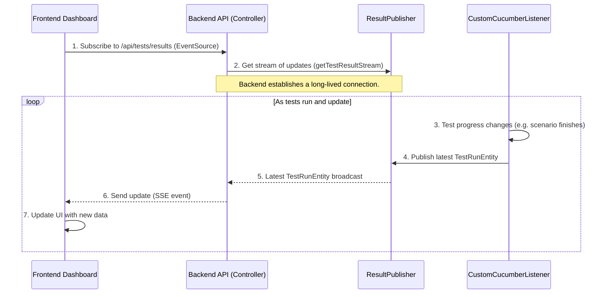

# Chapter 6: Real-time Results Reporting (SSE)

Welcome back to `lenstest`! In [Chapter 5: Test Run Lifecycle Management](05_test_run_lifecycle_management__.md), we learned how `lenstest` meticulously tracks every detail of a test run, from its start to its finish, even handling unexpected crashes. All this rich, up-to-the-minute information is stored in our database.

But what good is this perfectly managed data if you can't see it live? If a test run is taking 20 minutes, you don't want to keep hitting the refresh button on your browser to see the latest progress, do you? You want it to magically update on its own!

This is exactly what **Real-time Results Reporting (SSE)** solves!

## What Problem Does it Solve?

Imagine watching a live sports game online. You see the score and game updates instantly, without needing to refresh your browser. This is because the server is actively *sending* you updates as they happen.

The main problem Real-time Results Reporting (SSE) solves is providing a **live, dynamic view** of your test execution on the `lenstest` dashboard. Instead of constantly asking the server "Is there anything new? Is there anything new?", the server proactively tells your browser "Hey, here's an update!".

It's like having a **live news feed** for your test results. As tests finish or change status in the backend, the dashboard automatically updates, giving you immediate feedback without any manual refreshing. This provides an immediate and dynamic view of test execution, showing progress, status changes, and final outcomes as they occur.

## A Simple Use Case: Live Test Progress on the Dashboard

Let's say you just triggered a new test run from the `lenstest` dashboard.

Here's what you want to see, thanks to SSE:

1.  **Immediate Status**: The moment you click "Start," a new entry for "Run #XYZ" appears on your dashboard, instantly showing `IN_PROGRESS`.
2.  **Scenario Updates**: As each scenario completes (pass, fail, or skip), you see the overall stats for the run update on the dashboard in real-time.
3.  **Final Outcome**: Once all tests are done, the `IN_PROGRESS` status smoothly transitions to `FINISHED` (green checkmark) or `FAILED` (red X), all without you doing anything.

This gives you a feeling of being completely in sync with your test automation.

## Key Concepts of Real-time Results Reporting (SSE)

To make this "live news feed" work, `lenstest` uses a few important ideas:

1.  **SSE (Server-Sent Events)**:
    *   This is a special web technology that allows a server to send data to a client (like your web browser) over a single, long-lived connection.
    *   Unlike traditional web requests where the client asks and the server responds, with SSE, the server can *push* updates to the client whenever it has new information. Think of it as a one-way street from the server to your browser.

2.  **EventSource API**:
    *   This is a built-in feature in modern web browsers (and JavaScript) that makes it easy to connect to an SSE stream.
    *   Your frontend dashboard uses this API to "subscribe" to `lenstest`'s real-time updates.

3.  **"Live Broadcast Channel" (`ResultPublisher`)**:
    *   On the `lenstest` backend, we have a special component (`ResultPublisher`) that acts like a TV station broadcasting test result updates.
    *   Whenever a test run's status changes (e.g., a scenario finishes, a run starts), the `CustomCucumberListener` ([Chapter 5](05_test_run_lifecycle_management__.md)) tells this `ResultPublisher` to broadcast the latest `TestRunEntity` object.

4.  **Automatic Reconnection**:
    *   A great feature of `EventSource` is that if the network connection temporarily drops, your browser will automatically try to reconnect to the SSE stream and pick up where it left off. This makes the real-time updates very robust.

## How to Use It: Subscribing to Live Updates

As a `lenstest` user, you don't do anything special to "use" SSE. You simply open the `lenstest` dashboard in your browser, and the magic happens automatically!

Behind the scenes, the **Frontend Dashboard** (our React application) uses JavaScript to subscribe to the real-time updates from the `lenstest` **Backend API**.

Here's a simplified look at how the frontend code (`App.js`) sets up this subscription:

```javascript
// frontend/src/App.js

// ... other imports and state ...

useEffect(() => {
  // 1. Create a new EventSource, connecting to our backend's SSE endpoint
  const eventSource = new EventSource(
    "http://localhost:8080/api/tests/results"
  );

  // 2. Define what happens when a new message (test result update) arrives
  eventSource.onmessage = (event) => {
    const update = JSON.parse(event.data); // Data comes as JSON string

    // 3. Update the 'results' state in our React app
    setResults((prevResults) => {
      const index = prevResults.findIndex((r) => r.id === update.id);
      if (index !== -1) {
        // If the run already exists, update it with the new data
        const updatedResults = [...prevResults];
        updatedResults[index] = { ...updatedResults[index], ...update };
        return updatedResults;
      } else {
        // If it's a new run, add it to the list
        return [...prevResults, update];
      }
    });
  };

  // 4. Handle any errors that might occur with the connection
  eventSource.onerror = (error) => {
    console.error("SSE error:", error);
    eventSource.close(); // Close the connection on error
  };

  // 5. Clean up: Close the connection when the component unmounts
  return () => {
    eventSource.close();
  };
}, []); // Empty array means this runs once when the component first appears

// ... rest of the App component ...
```
This `useEffect` block in `App.js` is the heart of the real-time updates:
1.  It creates an `EventSource` object, pointing it to `http://localhost:8080/api/tests/results`. This tells the browser: "Connect to this URL and listen for live updates!"
2.  Whenever the backend sends a new update, the `eventSource.onmessage` function is called.
3.  Inside `onmessage`, the `event.data` (which is a JSON string containing the latest `TestRunEntity` data) is parsed.
4.  Then, the `setResults` function updates the `results` state in React. It intelligently finds the existing test run by its `id` and updates it, or adds it as a new run if it's the first time we're seeing it. This automatically causes the dashboard to re-render with the latest information.

## Under the Hood: How SSE Works in `lenstest`

Let's look behind the scenes at how `lenstest` sets up this live broadcast channel and sends updates.

### The Real-time Update Flow

When a test run is in progress and new information is available, here’s how it gets to your dashboard:



1.  **Frontend Subscribes**: Your `Frontend Dashboard` opens a connection to the `Backend API`'s special `/api/tests/results` endpoint using `EventSource`.
2.  **Backend Prepares Stream**: The `Backend API` (specifically the `TestExecutionController`) tells the `ResultPublisher` that it wants to receive all future updates.
3.  **Test Progress Changes**: As a test run proceeds, the `CustomCucumberListener` ([Chapter 5](05_test_run_lifecycle_management__.md)) detects important events, like a scenario finishing or an overall test run starting/ending.
4.  **Listener Publishes**: After updating the `TestRun` data in the database, the `CustomCucumberListener` calls `ResultPublisher.publish()` with the latest `TestRunEntity` object.
5.  **Publisher Broadcasts**: The `ResultPublisher` receives this update and immediately broadcasts it to *all* connected `Backend API` endpoints (and thus to all connected frontend dashboards).
6.  **Backend Sends SSE Event**: The `Backend API` takes this broadcasted `TestRunEntity` and formats it as an SSE event, sending it down the open connection to the `Frontend Dashboard`.
7.  **Frontend Updates UI**: The `Frontend Dashboard` receives the SSE event, parses the data, and updates its React state, causing the dashboard to automatically refresh with the latest test results.

### The Code Behind the Scenes

Let's look at the key backend components that make this real-time reporting possible.

#### 1. The `ResultPublisher` (The Broadcaster)

This class is responsible for being the central "hub" that collects updates and broadcasts them to all subscribers.

```java
// src/main/java/com/db/lenstest/config/ResultPublisher.java
package com.db.lenstest.config;

import com.db.lenstest.lensEntity.TestRunEntity;
import org.springframework.stereotype.Component;
import reactor.core.publisher.Flux; // Represents a stream of data
import reactor.core.publisher.Sinks; // A way to "emit" items into a Flux

@Component // Marks this as a Spring component
public class ResultPublisher {
    // Sinks.many().multicast().onBackpressureBuffer() creates a broadcast channel.
    // 'multicast' means it sends to multiple subscribers.
    // 'onBackpressureBuffer' means it can temporarily store events if subscribers are slow.
    private static final Sinks.Many<TestRunEntity> sink = Sinks.many().multicast().onBackpressureBuffer();

    // This method is called by other parts of lenstest (like CustomCucumberListener)
    // to send out a new test run update.
    public static void publish(TestRunEntity testRunEntity) {
        sink.tryEmitNext(testRunEntity); // Tries to emit the new data into the channel
    }

    // This method is used by our API controller to expose the stream
    // to the frontend.
    public Flux<TestRunEntity> getTestResultStream() {
        return sink.asFlux(); // Converts our 'sink' into a 'Flux' (a reactive stream)
    }
}
```
The `ResultPublisher` uses Spring's `reactor.core.publisher.Sinks` and `Flux` to create a reactive stream. Think of `Sinks.Many` as a hose pipe that can send water (test updates) to many sprinklers (frontend clients). The `publish()` method is how `lenstest` puts water into the hose, and `getTestResultStream()` is how the backend controller connects a sprinkler.

#### 2. The `CustomCucumberListener` (The Reporter)

As we saw in [Chapter 5](05_test_run_lifecycle_management__.md), this listener is the central point for updating test run data. It also reports these updates to the `ResultPublisher`.

```java
// src/main/java/com/db/lenstest/listener/CustomCucumberListener.java
package com.db.lenstest.listener;

import com.db.lenstest.config.ResultPublisher; // Import our ResultPublisher
// ... other imports ...

public class CustomCucumberListener implements ConcurrentEventListener {

    // ... testRun object and other autowired services ...
    
    // This method is called when a scenario finishes
    private void ScenarioFinished(TestCaseFinished event) {
        // ... update scenario status, feature status in testRun DTO ...

        // Save updated testRun DTO to DB after each scenario
        testRunEntityRepository.save(testRun.toEntity())
                .doOnSuccess(ResultPublisher::publish) // <--- THIS IS KEY! Publish the update!
                .subscribe(); // Execute the reactive flow
    }
    
    // This method is called when the entire test run finishes
    private void runFinished(TestRunFinished event) {
        // ... stop heartbeat, finalize test run status ...

        testRunEntityRepository
                .save(testRun.toEntity())
                .doOnSuccess(testRunEntity -> {
                    log.info("Test run completed and saved: " + testRunEntity.getId());
                    ResultPublisher.publish(testRunEntity); // <--- Publish the final update!
                })
                .subscribe();
    }
    // ... other methods ...
}
```
The key lines here are `ResultPublisher::publish`. After the `testRunEntity` is saved to the database (which means it's finalized and ready), the `CustomCucumberListener` immediately calls `ResultPublisher.publish(testRunEntity)` to send that latest information out to anyone who is listening. This happens after every scenario and once more when the entire run is finished.

#### 3. The `TestExecutionController` (The API Endpoint)

This controller exposes the SSE stream to the frontend.

```java
// src/main/java/com/db/lenstest/controller/TestExecutionController.java
package com.db.lenstest.controller;

import com.db.lenstest.config.ResultPublisher; // Import our ResultPublisher
// ... other imports ...

@RestController
@RequestMapping("/api/tests")
@CrossOrigin(origins = "*")
public class TestExecutionController {

    // ... other autowired services ...
    @Autowired
    private ResultPublisher publisher; // Spring automatically gives us the ResultPublisher

    // This method creates the SSE endpoint for real-time results
    @GetMapping(value = "/results", produces = MediaType.TEXT_EVENT_STREAM_VALUE)
    public Flux<TestRunEntity> streamTestResults() {
        // Return the stream of TestRunEntity updates from the publisher
        return publisher.getTestResultStream();
    }

    // ... other endpoints for executing tests, getting history, etc. ...
}
```
The `@GetMapping(value = "/results", produces = MediaType.TEXT_EVENT_STREAM_VALUE)` annotation is crucial here:
*   `@GetMapping("/results")`: This defines the URL endpoint that the frontend connects to.
*   `produces = MediaType.TEXT_EVENT_STREAM_VALUE`: This tells the web server that this endpoint will be sending data in the Server-Sent Events format, which browsers understand.
*   `return publisher.getTestResultStream();`: This is where the magic happens. The controller simply returns the `Flux` (stream) from our `ResultPublisher`. Spring Boot automatically handles turning this `Flux` into an ongoing SSE connection, sending each new `TestRunEntity` as a separate event to the connected browser.

## Conclusion

In this chapter, we explored **Real-time Results Reporting (SSE)**, the `lenstest` feature that brings your test dashboard to life. We learned how SSE acts like a live news feed, pushing updates from the server to your browser as tests run, eliminating the need for constant refreshing. We saw how the `EventSource` API on the frontend subscribes to these updates and how, on the backend, the `CustomCucumberListener` publishes `TestRunEntity` changes to the `ResultPublisher`, which then streams them through the `TestExecutionController` to your browser.

This system ensures that you always have an immediate and dynamic view of your test automation progress. Now that we've covered how results are generated, managed, and reported in real-time, the final piece of the puzzle is understanding where all this valuable data is stored permanently. That's what we'll dive into in [Chapter 7: MongoDB Persistence Layer](07_mongodb_persistence_layer_.md)!

---

<sub><sup>Generated by [AI Codebase Knowledge Builder](https://github.com/The-Pocket/Tutorial-Codebase-Knowledge).</sup></sub> <sub><sup>**References**: [[1]](https://github.com/amangupta0709/lenstest/blob/1105aa93ea0a8c60528ac519e6b0525f06c79c72/frontend/src/App.js), [[2]](https://github.com/amangupta0709/lenstest/blob/1105aa93ea0a8c60528ac519e6b0525f06c79c72/src/main/java/com/db/lenstest/config/ResultPublisher.java), [[3]](https://github.com/amangupta0709/lenstest/blob/1105aa93ea0a8c60528ac519e6b0525f06c79c72/src/main/java/com/db/lenstest/controller/TestExecutionController.java), [[4]](https://github.com/amangupta0709/lenstest/blob/1105aa93ea0a8c60528ac519e6b0525f06c79c72/src/main/java/com/db/lenstest/listener/CustomCucumberListener.java)</sup></sub>