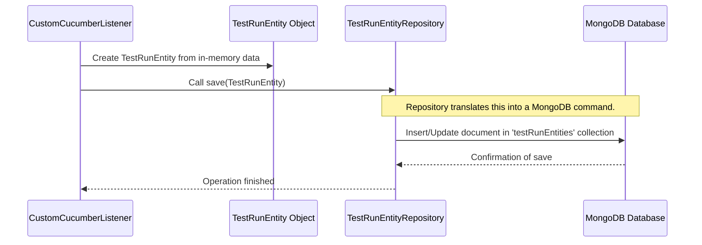

# Chapter 7: MongoDB Persistence Layer

Welcome back to `lenstest`! In [Chapter 6: Real-time Results Reporting (SSE)](06_real_time_results_reporting__sse__.md), we explored how live test results are pushed to your dashboard. But where do all these results, and all the configurations for schedules and more, actually *go* when they need to be saved permanently? How does `lenstest` remember everything, even after you close and reopen the application?

This is where the **MongoDB Persistence Layer** comes in! It's `lenstest`'s dedicated "digital filing cabinet" for all its important data.

## What Problem Does it Solve?

Imagine you've successfully run a test suite, and it passed! You're happy, you close your computer, and you go home. The next day, you open `lenstest` again. You want to look back at that exact test run from yesterday, or even last month, to see all the details. If `lenstest` didn't save that information somewhere, it would be gone forever!

The **MongoDB Persistence Layer** solves this crucial problem:

1.  **Permanent Storage**: It ensures that all test-related data – like the history of every test run, including features, scenarios, steps, and their statuses – is saved permanently.
2.  **Accessibility**: It makes sure this saved data is always accessible for you to view on the dashboard, analyze, or use for reports, even if the `lenstest` application restarts.
3.  **Reliability**: It provides a robust way to store data, ensuring that your test results and configurations are not lost.

Think of it like `lenstest` having a dedicated library. Every time a test run happens, or a schedule is created, a detailed "book" about it is written and carefully placed on a shelf. When you need to see something, the library staff (the persistence layer) helps you find the right book.

## A Simple Use Case: Saving a Test Run's History

Let's walk through our core use case: **saving the detailed history of a single test run**.

When the [CustomCucumberListener](05_test_run_lifecycle_management__.md) in `lenstest` finishes processing a test run, it has a complete picture: which tests ran, their statuses, timings, and any errors. This information needs to be saved so you can view it later on the [Frontend Test Dashboard](01_frontend_test_dashboard_.md).

Here’s what happens at a high level:

1.  A test run completes, and `lenstest` has all its details in an object.
2.  `lenstest` tells the persistence layer: "Please save this entire test run's data."
3.  The persistence layer takes this data and stores it in **MongoDB**.
4.  Later, when you open the dashboard, it asks the persistence layer: "Show me all past test runs."
5.  The persistence layer retrieves the saved data from **MongoDB** and sends it to the dashboard.

## Key Concepts of MongoDB Persistence Layer

To build this "digital filing cabinet," `lenstest` uses these important concepts:

1.  **MongoDB**:
    *   This is the actual **database software** that `lenstest` uses.
    *   It's a type of database called a **NoSQL database**, which means it's very flexible. Instead of storing data in rigid tables (like a spreadsheet), it stores data in "documents."
    *   Think of each "document" as a single file in a flexible filing system, where each file can hold different kinds of information, often in a format similar to JSON (JavaScript Object Notation).

2.  **Entities (`TestRunEntity`, `ScheduledRunEntity`)**:
    *   These are like **blueprints** for the "documents" that get stored in MongoDB.
    *   An `TestRunEntity` is a blueprint for saving all the details of a completed test run.
    *   A `ScheduledRunEntity` is a blueprint for saving the configuration of an automated test schedule.
    *   When `lenstest` wants to save something to MongoDB, it first creates an object following one of these blueprints.

3.  **Repositories (`TestRunEntityRepository`, `ScheduledRunRepository`)**:
    *   These are special **"database helpers"** in `lenstest`. They act like the librarians for our MongoDB database.
    *   Instead of you having to write complex database commands, you simply tell a repository: "Hey, `TestRunEntityRepository`, please `save` this test run!" or "Please `findAll` test runs!"
    *   Spring Data MongoDB (a part of our backend framework) automatically creates these helpers for us.

4.  **`MongoTemplate` / `ReactiveMongoTemplate`**:
    *   These are more advanced tools used internally by the repositories to actually talk to MongoDB.
    *   `lenstest` uses two versions: `MongoTemplate` for some direct, traditional database operations (e.g., in some Cucumber steps), and `ReactiveMongoTemplate` for the main application, especially when handling streams of data like with SSE. "Reactive" means it's designed to be very efficient when dealing with many requests without blocking the application.

## How to Use It: Saving and Retrieving Data (Behind the Scenes)

As a `lenstest` user, you don't directly write code to "use" the MongoDB Persistence Layer. Instead, other parts of `lenstest` (like the listener that processes test results, or the service that manages schedules) use it constantly.

Let's see how the `CustomCucumberListener` (from [Chapter 5: Test Run Lifecycle Management](05_test_run_lifecycle_management__.md)) saves a `TestRun` after it's finished.

```java
// src/main/java/com/db/lenstest/listener/CustomCucumberListener.java

// ... other imports ...
import com.db.lenstest.lensRepository.TestRunEntityRepository; // Our database helper

public class CustomCucumberListener implements ConcurrentEventListener {

    // Spring automatically provides our database helper here
    @Autowired
    private TestRunEntityRepository testRunEntityRepository; 

    private TestRun testRun = new TestRun(); // The current test run's data

    // ... other methods for test run lifecycle ...

    private void runFinished(TestRunFinished event) {
        // ... code to stop heartbeat and set completion time ...

        testRun.setExecutionStage(ExecutionStage.FINISHED); // Mark as FINISHED
        
        // This is where the TestRunEntityRepository is used to save!
        // testRun.toEntity() converts our in-memory data to the database blueprint
        testRunEntityRepository.save(testRun.toEntity()) 
                               .subscribe(); // Save to MongoDB and subscribe to the result
    }
}
```
In this snippet, `testRunEntityRepository.save(testRun.toEntity())` is the key line. It tells our "database helper" to take the `TestRun` data (converted into a `TestRunEntity` blueprint) and save it. The `.subscribe()` then makes sure the saving operation actually happens.

Retrieving all past test runs is just as simple:

```java
// src/main/java/com/db/lenstest/controller/TestExecutionController.java

// ... other imports ...
import com.db.lenstest.lensEntity.TestRunEntity; // Our blueprint for a test run
import com.db.lenstest.lensRepository.TestRunEntityRepository; // Our database helper

@RestController
@RequestMapping("/api/tests")
@CrossOrigin(origins = "*")
public class TestExecutionController {

    // Spring automatically provides our database helper here
    @Autowired
    private TestRunEntityRepository testRunEntityRepository;

    @GetMapping("/") // This method handles requests to get all test runs
    public List<TestRunEntity> getAllTestRuns(){
        // Ask the repository to find ALL TestRunEntity records
        return testRunEntityRepository.findAll().collectList().block();
    }
}
```
Here, `testRunEntityRepository.findAll()` retrieves all `TestRunEntity` documents from MongoDB. The `collectList().block()` then gathers all these documents into a simple list that the frontend can display.

## Under the Hood: How MongoDB Stores Data

Let's look behind the curtain at how this data is actually stored in MongoDB and how `lenstest` connects to it.

### The Data Saving Flow

When `lenstest` saves a `TestRunEntity`, here’s a simplified sequence of events:



1.  **`CustomCucumberListener` Prepares Data**: The listener gathers all the test run information and packages it into a `TestRunEntity` object (our blueprint).
2.  **Repository Call**: The listener then calls the `save()` method on the `TestRunEntityRepository`, passing the `TestRunEntity` object.
3.  **Repository Talks to MongoDB**: The `TestRunEntityRepository` (powered by Spring Data MongoDB) takes this `TestRunEntity` object and converts it into a format that MongoDB understands (like a JSON document). It then sends a command to MongoDB to store or update this document.
4.  **MongoDB Stores Document**: MongoDB receives the command and saves the document in a "collection" named `testRunEntities`.
5.  **Confirmation**: MongoDB confirms the save operation, and this confirmation travels back through the repository to the listener.

### The Code Behind the Scenes

Let's look at the actual blueprints (entities), the helpers (repositories), and the connection setup (`configs`) that make this possible.

#### 1. The `TestRunEntity` and `ScheduledRunEntity` (The Blueprints)

These classes define the structure of the data stored in MongoDB. They are POJOs (Plain Old Java Objects) with annotations.

```java
// src/main/java/com/db/lenstest/lensEntity/TestRunEntity.java
package com.db.lenstest.lensEntity;

import lombok.Data; // Adds getters/setters automatically
import org.springframework.data.annotation.Id; // Marks 'id' as the unique ID for MongoDB
import java.time.LocalDateTime;
// ... other imports ...

@Data // Lombok annotation to generate boilerplate code
public class TestRunEntity {

    @Id // This field will be the unique identifier in MongoDB
    private String id;

    private String startedAt;
    private String completedAt;
    private String executionStage; // E.g., IN_PROGRESS, FINISHED, FAILED
    private String filterTag; // E.g., "@smoke"
    // ... other fields for stats, features, scenarios, steps ...
    private LocalDateTime lastHeartbeat; // Used for lifecycle management
    // ... (many more fields for detailed test results) ...
}
```
The `@Id` annotation is key here; it tells Spring Data MongoDB that the `id` field should be used as the unique identifier for this document in the database. When `lenstest` saves a new `TestRunEntity`, MongoDB often generates a unique `id` for it.

Similarly, for our scheduled runs:

```java
// src/main/java/com/db/lenstest/lensEntity/ScheduledRunEntity.java
package com.db.lenstest.lensEntity;

import lombok.Data;
import org.springframework.data.annotation.Id;
import org.springframework.data.mongodb.core.mapping.Document; // Specifies collection name
import java.time.LocalDateTime;
import java.util.List;

@Data
@Document(collection = "scheduledRuns") // This entity will be stored in 'scheduledRuns' collection
public class ScheduledRunEntity {
    
    @Id
    private String id;
    
    private String name; // "Nightly Critical Tests"
    private List<String> includeTags; // ["critical"]
    private String cronExpression; // "0 0 2 * * *"
    private boolean active;
    private LocalDateTime createdAt;
    private LocalDateTime lastRunAt;
    // ... other fields ...
}
```
The `@Document(collection = "scheduledRuns")` annotation explicitly tells MongoDB to store these documents in a collection named `scheduledRuns`. If omitted, MongoDB would default to a collection name based on the class name (e.g., `testRunEntity`).

#### 2. The Repositories (The Database Helpers)

These interfaces define the basic operations (like save, find, delete) for our entities.

```java
// src/main/java/com/db/lenstest/lensRepository/TestRunEntityRepository.java
package com.db.lenstest.lensRepository;

import com.db.lenstest.lensEntity.TestRunEntity;
import org.springframework.data.mongodb.repository.ReactiveMongoRepository; // For reactive operations
import reactor.core.publisher.Flux; // For streaming multiple results
import reactor.core.publisher.Mono; // For a single result

import java.time.LocalDateTime;

// Extends ReactiveMongoRepository to get basic CRUD operations for TestRunEntity
public interface TestRunEntityRepository extends ReactiveMongoRepository<TestRunEntity, String> {
    
    // Custom query to find runs that are IN_PROGRESS and from a *different* process ID
    Flux<TestRunEntity> findByExecutionStageAndProcessIdNot(String executionStage, String processId);
    
    // Custom query to find IN_PROGRESS runs that started before a specific cutoff time
    Flux<TestRunEntity> findByExecutionStageAndStartedAtBefore(String executionStage, LocalDateTime cutoffTime);
}
```
By simply `extending ReactiveMongoRepository<TestRunEntity, String>`, we automatically get methods like `save()`, `findAll()`, `findById()`, and `delete()` for our `TestRunEntity` objects. We can also define our own custom methods, and Spring Data MongoDB is smart enough to create the necessary database queries for us (e.g., `findByExecutionStageAndProcessIdNot`).

There's also a synchronous version for parts of the application that don't need reactive capabilities (e.g., a simple utility that fetches a single document).

```java
// src/main/java/com/db/lenstest/repository/TestDocumentRepository.java
package com.db.lenstest.repository;

import com.db.lenstest.model.TestDocument; // A different entity for a different purpose
import org.springframework.data.mongodb.repository.MongoRepository; // Non-reactive repository

// This repository works with a 'TestDocument' entity (not shown in detail)
// and provides standard, blocking database operations.
public interface TestDocumentRepository extends MongoRepository<TestDocument, String> {
    // Custom queries can be added here
}
```

#### 3. The `MongoConfig` and `ReactiveMongoConfig` (The Connection Setup)

These configuration files tell `lenstest` how and where to connect to the MongoDB database.

```java
// src/main/java/com/db/lenstest/config/ReactiveMongoConfig.java
package com.db.lenstest.config;

import com.mongodb.reactivestreams.client.MongoClient; // Reactive MongoDB client
import com.mongodb.reactivestreams.client.MongoClients;
import org.springframework.context.annotation.Bean;
import org.springframework.context.annotation.Configuration;
import org.springframework.data.mongodb.core.ReactiveMongoTemplate; // Reactive template
import org.springframework.data.mongodb.repository.config.EnableReactiveMongoRepositories;

// Enables Spring Data MongoDB for reactive repositories
@EnableReactiveMongoRepositories(
        basePackages = "com.db.lenstest.lensRepository", // Where to find our reactive repositories
        reactiveMongoTemplateRef = "reactiveMongoTemplate"
)
@Configuration
public class ReactiveMongoConfig {

    @Bean // This method provides a 'MongoClient' object for reactive operations
    public MongoClient reactiveMongoClient() {
        // Connects to MongoDB running on 'localhost' at port '27017'
        return MongoClients.create("mongodb://localhost:27017");
    }

    @Bean // This method provides a 'ReactiveMongoTemplate' object
    public ReactiveMongoTemplate reactiveMongoTemplate(MongoClient reactiveMongoClient){
           // Uses the 'reactiveMongoClient' and connects to the database named "lenstest"
           return new ReactiveMongoTemplate(reactiveMongoClient, "lenstest");
    }
}
```
This `ReactiveMongoConfig` is vital:
*   `@EnableReactiveMongoRepositories`: Tells Spring to scan for our `ReactiveMongoRepository` interfaces in the specified `basePackages`.
*   `reactiveMongoClient()`: Creates the client that actually establishes a connection to the MongoDB server. `mongodb://localhost:27017` means MongoDB is running on the same machine (`localhost`) on its default port (`27017`).
*   `reactiveMongoTemplate()`: Creates the `ReactiveMongoTemplate`, which wraps the `MongoClient` and specifies that `lenstest` will use the database named `"lenstest"` within that MongoDB server.

There's also a similar configuration for synchronous (non-reactive) MongoDB operations, mainly used in older or specific parts of the application:

```java
// src/main/java/com/db/lenstest/config/MongoConfig.java
package com.db.lenstest.config;

import com.mongodb.client.MongoClient; // Synchronous MongoDB client
import com.mongodb.client.MongoClients;
import org.springframework.context.annotation.Bean;
import org.springframework.context.annotation.Configuration;
import org.springframework.data.mongodb.core.MongoTemplate; // Synchronous template
import org.springframework.data.mongodb.repository.config.EnableMongoRepositories;

// Enables Spring Data MongoDB for synchronous repositories
@EnableMongoRepositories(
        basePackages = "com.db.lenstest.repository", // Where to find our synchronous repositories
        mongoTemplateRef = "mongoTemplate"
)
@Configuration
public class MongoConfig {
    @Bean
    public MongoClient mongoClient() {
        return MongoClients.create("mongodb://localhost:27017");
    }

    @Bean
    public MongoTemplate mongoTemplate(MongoClient mongoClient){
        return new MongoTemplate(mongoClient, "lenstest");
    }
}
```
Both `ReactiveMongoConfig` and `MongoConfig` serve the same fundamental purpose: to tell `lenstest` how to connect to the MongoDB server and which database (`lenstest`) to use for storing data. The main difference is whether they use "reactive" (non-blocking) or "synchronous" (blocking) ways of interacting with the database.

## Conclusion

In this chapter, we explored the **MongoDB Persistence Layer**, the crucial component that acts as `lenstest`'s memory. We learned how it uses MongoDB, a flexible NoSQL database, to permanently store all test-related data as "documents" (like `TestRunEntity` and `ScheduledRunEntity`). We saw how `lenstest` uses "repositories" as convenient helpers to save and retrieve this data without needing complex database commands. This persistence layer ensures that all your test results and configurations are robustly saved and always available for your [Frontend Test Dashboard](01_frontend_test_dashboard_.md), making `lenstest` a reliable tool for your automation needs.

---

<sub><sup>Generated by [AI Codebase Knowledge Builder](https://github.com/The-Pocket/Tutorial-Codebase-Knowledge).</sup></sub> <sub><sup>**References**: [[1]](https://github.com/amangupta0709/lenstest/blob/1105aa93ea0a8c60528ac519e6b0525f06c79c72/src/main/java/com/db/lenstest/config/MongoConfig.java), [[2]](https://github.com/amangupta0709/lenstest/blob/1105aa93ea0a8c60528ac519e6b0525f06c79c72/src/main/java/com/db/lenstest/config/ReactiveMongoConfig.java), [[3]](https://github.com/amangupta0709/lenstest/blob/1105aa93ea0a8c60528ac519e6b0525f06c79c72/src/main/java/com/db/lenstest/lensEntity/ScheduledRunEntity.java), [[4]](https://github.com/amangupta0709/lenstest/blob/1105aa93ea0a8c60528ac519e6b0525f06c79c72/src/main/java/com/db/lenstest/lensEntity/TestRunEntity.java), [[5]](https://github.com/amangupta0709/lenstest/blob/1105aa93ea0a8c60528ac519e6b0525f06c79c72/src/main/java/com/db/lenstest/lensRepository/TestRunEntityRepository.java), [[6]](https://github.com/amangupta0709/lenstest/blob/1105aa93ea0a8c60528ac519e6b0525f06c79c72/src/main/java/com/db/lenstest/repository/TestDocumentRepository.java)</sup></sub>