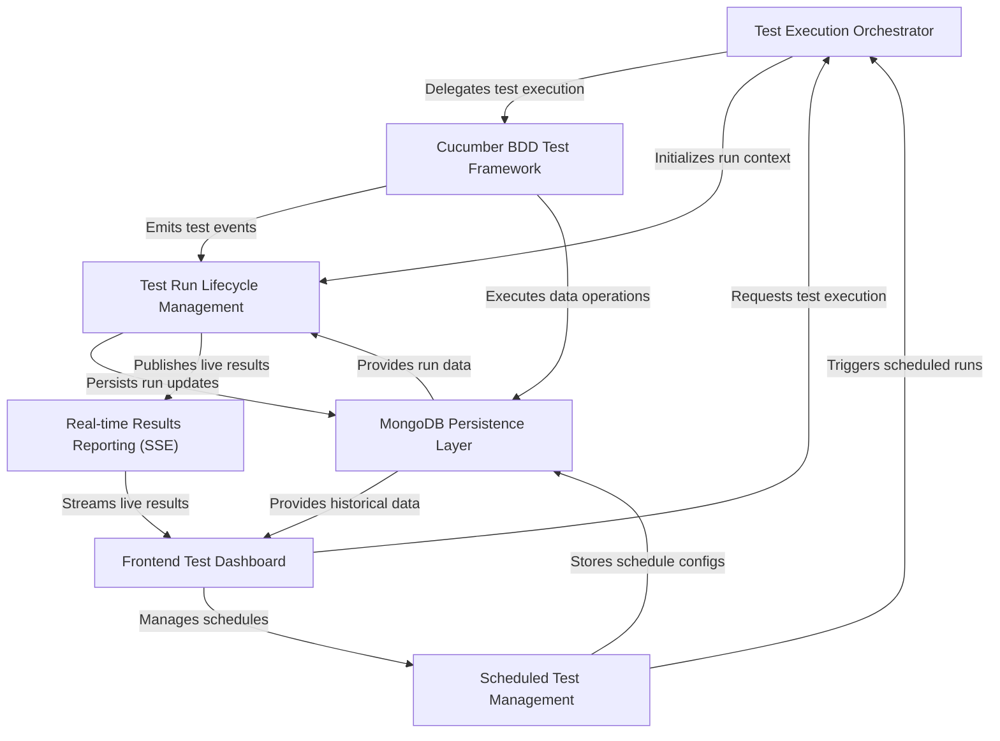

# Tutorial: lenstest

The `lenstest` project is a comprehensive **test automation platform**. It allows users to **define behavior-driven tests** using Cucumber, **execute these tests** either manually or on a schedule, and then **track their entire lifecycle**. All test results and configurations are **persisted in MongoDB** and presented through a **real-time interactive dashboard** for immediate feedback and historical analysis.

## Visual Overview

## Chapters

1. [Frontend Test Dashboard
](01_frontend_test_dashboard_.md)
2. [Scheduled Test Management
](02_scheduled_test_management_.md)
3. [Test Execution Orchestrator
](03_test_execution_orchestrator_.md)
4. [Cucumber BDD Test Framework
](04_cucumber_bdd_test_framework_.md)
5. [Test Run Lifecycle Management
](05_test_run_lifecycle_management_.md)
6. [Real-time Results Reporting (SSE)
](06_real_time_results_reporting__sse__.md)
7. [MongoDB Persistence Layer
](07_mongodb_persistence_layer_.md)

---

Generated by [AI Codebase Knowledge Builder](https://github.com/The-Pocket/Tutorial-Codebase-Knowledge).